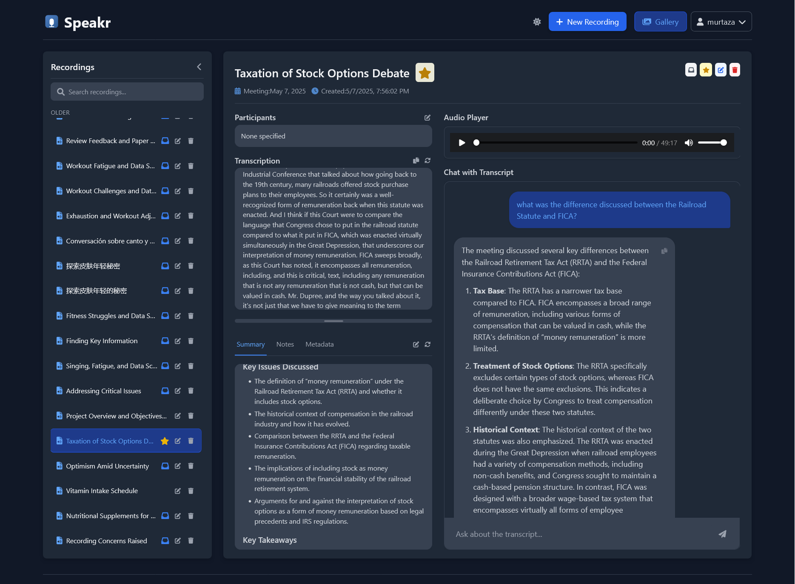
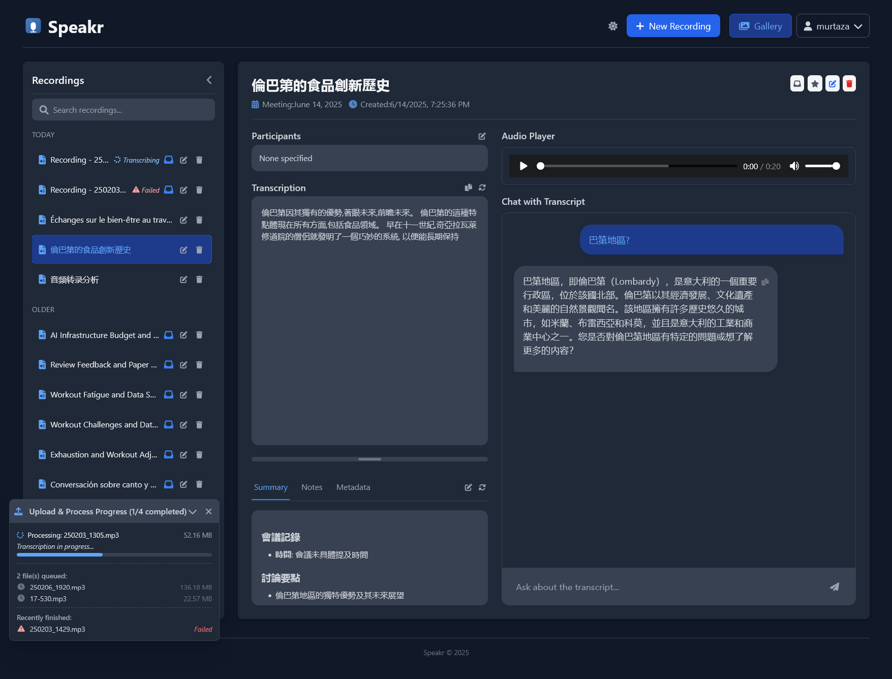
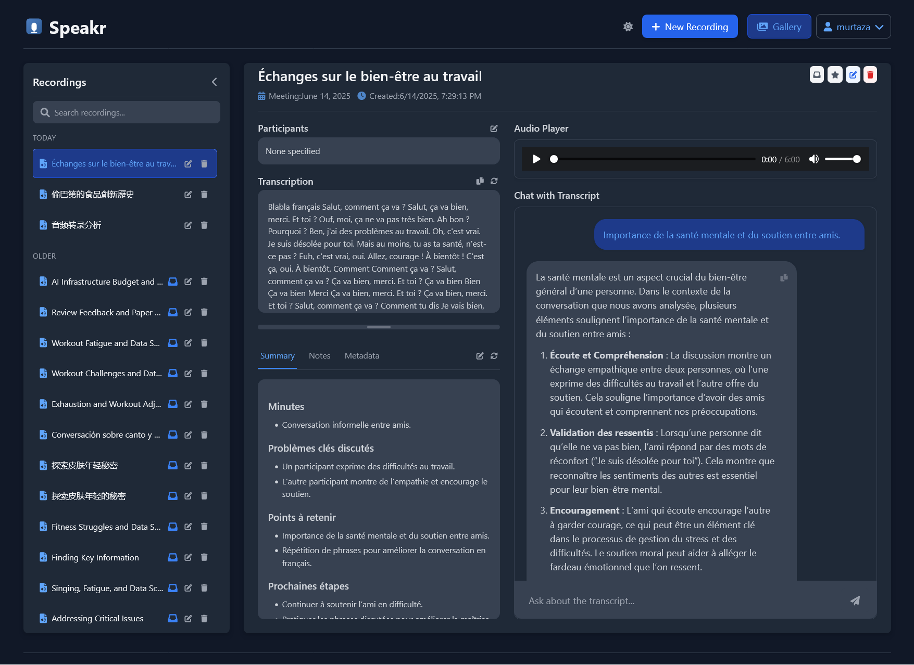
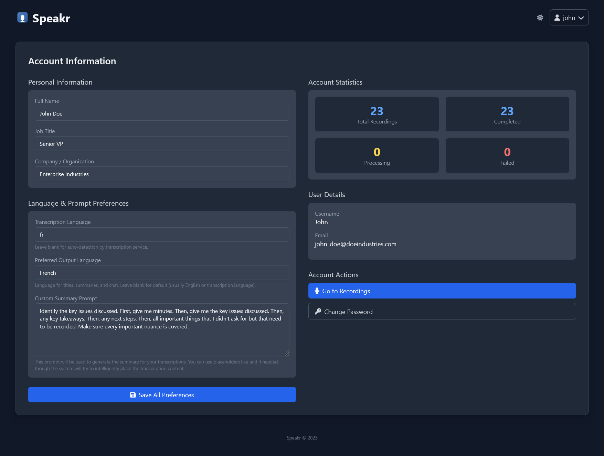

# Speakr

[](https://www.gnu.org/licenses/agpl-3.0) [](https://github.com/murtaza-nasir/speakr/actions/workflows/docker-publish.yml)

This project is dual-licensed. See the [License](#license) section for details.

Speakr is a personal, self-hosted web application designed for transcribing audio recordings (like meetings), generating concise summaries and titles, and interacting with the content through a chat interface. Keep all your meeting notes and insights securely on your own server.

## Screenshots





## What's New?

*   **Simplified Docker Setup:** Configuration is now managed via a single `.env` file, making setup faster and easier.
*   **ASR Webservice Integration:** Added support for a powerful ASR (Automatic Speech Recognition) webservice.
*   **Speaker Diarization:** Identify and label different speakers in your recordings. **Note: This feature requires the ASR Webservice method with the `whisperx` engine.**
*   **Transcription Reprocessing:** A new "Reprocess" button allows you to re-run transcription with different settings (e.g., to add diarization).
*   **Speaker Identification:** A new modal helps you name speakers, with highlighting for clarity. You can also automatically identify speakers using an LLM.
*   **Saved Speaker Profiles:** Save identified speakers for auto-completion in future transcriptions. View and manage them on your Account page.
*   **Enhanced Summaries:** Summarization now includes user context (name, title) and allows for custom prompts.

## Features

*   **Audio Upload:** Upload audio files (MP3, WAV, M4A, etc.) via drag-and-drop or file selection.
*   **Transcription:** Choose between a standard OpenAI-compatible API or a more advanced ASR Webservice.
*   **Speaker Diarization:** (ASR/WhisperX only) Automatically detect and separate different speakers in the transcript.
*   **AI Summarization & Titling:** Generates concise titles and summaries using configurable LLMs.
*   **Interactive Chat:** Ask questions and interact with the transcription content using an AI model.
*   **Metadata Editing:** Edit titles, participants, meeting dates, summaries, and notes.
*   **User Management:** Secure user registration and login system with an admin dashboard for managing users.
*   **Customization:** Users can set their own language preferences, custom summarization prompts, and professional context to improve AI results.

## Setup Instructions

The recommended method is to use the pre-built Docker image, which is fast and simple.

### Easy Setup (Pre-built Docker Image)

You do not need to clone this repository for this method. You only need Docker installed.

1.  **Download the `docker-compose.yml` file:**
    This file tells Docker how to run Speakr. Download it from the repository:
    ```bash
    curl -o docker-compose.yml https://raw.githubusercontent.com/murtaza-nasir/speakr/main/docker-compose.example.yml
    ```
    *(If you don't have `curl`, you can use `wget` or just copy the contents of `docker-compose.example.yml` from the repository into a new file named `docker-compose.yml`)*

2.  **Download a Configuration (`.env`) Template:**
    Your choice here depends on which transcription method you want to use. Download one of the templates and rename it to `.env`.

    *   **Option A: Standard API (e.g., OpenAI, local API)**
        This is the simplest method.
        ```bash
        curl -o .env https://raw.githubusercontent.com/murtaza-nasir/speakr/main/env.whisper.example
        ```
        Now, **edit the `.env` file** with your API keys and settings. Here are a few examples of what your configuration could look like:

        *Example 1: Using OpenRouter for Chat and OpenAI for Transcription*
        ```dotenv
        TEXT_MODEL_BASE_URL=https://openrouter.ai/api/v1
        TEXT_MODEL_API_KEY=your_openrouter_key
        TEXT_MODEL_NAME=openai/gpt-4o-mini

        TRANSCRIPTION_BASE_URL=https://api.openai.com/v1
        TRANSCRIPTION_API_KEY=your_openai_key
        WHISPER_MODEL=whisper-1
        ```
        *Example 2: Using OpenAI for both Chat and Transcription*
        ```dotenv
        TEXT_MODEL_BASE_URL=https://api.openai.com/v1
        TEXT_MODEL_API_KEY=your_openai_key
        TEXT_MODEL_NAME=gpt-4o-mini

        TRANSCRIPTION_BASE_URL=https://api.openai.com/v1
        TRANSCRIPTION_API_KEY=your_openai_key
        WHISPER_MODEL=whisper-1
        ```
        *Example 3: Using a self-hosted local Whisper API*
        ```dotenv
        TEXT_MODEL_BASE_URL=https://openrouter.ai/api/v1
        TEXT_MODEL_API_KEY=your_openrouter_key
        TEXT_MODEL_NAME=openai/gpt-4o-mini

        TRANSCRIPTION_BASE_URL=http://192.168.1.100:8080/v1
        TRANSCRIPTION_API_KEY=none
        WHISPER_MODEL=large-v3
        ```

    *   **Option B: ASR Webservice (for Speaker Diarization)**
        This method requires a separate ASR webservice container but enables speaker identification.
        ```bash
        curl -o .env https://raw.githubusercontent.com/murtaza-nasir/speakr/main/env.asr.example
        ```
        Now, **edit the `.env` file** with your ASR service URL and other settings. It will look like this:
        *Example for a local ASR service:*
        ```dotenv
        # This flag tells the app to use the ASR endpoint
        USE_ASR_ENDPOINT=true

        # ASR Endpoint Details
        ASR_BASE_URL=http://192.168.68.85:9000
        ASR_ENCODE=true
        ASR_TASK=transcribe
        ASR_DIARIZE=true # Must be true to enable diarization
        ASR_MIN_SPEAKERS=1
        ASR_MAX_SPEAKERS=5

        # --- Text Generation Model ---
        TEXT_MODEL_BASE_URL=https://openrouter.ai/api/v1
        TEXT_MODEL_API_KEY=your_openrouter_key
        TEXT_MODEL_NAME=openai/gpt-4o-mini
        ```

3.  **Start the Application:**
    In your terminal, in the same directory as your `docker-compose.yml` and `.env` files, run:
    ```bash
    docker compose up -d
    ```

### Advanced Setup (Build from Source)

If you want to modify the code or build the Docker image yourself, clone the repository first.

1.  **Clone the Repository:**
    ```bash
    git clone https://github.com/murtaza-nasir/speakr.git
    cd speakr
    ```
2.  **Create a `.env` file:**
    Copy one of the examples (`env.whisper.example` or `env.asr.example`) and customize it.
    ```bash
    # For standard API
    cp env.whisper.example .env

    # OR for ASR Webservice
    cp env.asr.example .env
    ```
    Edit the `.env` file with your settings.
3.  **Build and Start:**
    ```bash
    docker compose up -d --build
    ```

### Recommended ASR Webservice Setup

**Speaker Diarization only works with the ASR method and requires the `whisperx` engine.** Here is an example `docker-compose.yml` for running the ASR service itself. You would run this *in addition* to the Speakr app container.

```yaml
services:
  whisper-asr-webservice:
    image: onerahmet/openai-whisper-asr-webservice:latest-gpu
    container_name: whisper-asr-webservice
    ports:
      - "9000:9000"
    environment:
      - ASR_MODEL=distil-large-v3 # or large-v3, medium
      - ASR_COMPUTE_TYPE=fp16     # or int8, fp32
      - ASR_ENGINE=whisperx        # REQUIRED for diarization
      - HF_TOKEN=your_hugging_face_token # Optional
    deploy:
      resources:
        reservations:
          devices:
            - driver: nvidia
              capabilities: [gpu]
              device_ids: ["0"]
    restart: unless-stopped
```

Speakr has been tested with the recommended `onerahmet/openai-whisper-asr-webservice` image. Other ASR webservices might work but have not been tested. For more information on the recommended service and its various configurations, please see the official resources.

## Usage Guide

1.  **Register/Login:** Access the application at `http://localhost:8899`. The admin user is created from the `ADMIN_*` variables in your `.env` file on first launch.
2.  **Set Preferences (Recommended):** Go to your **Account** page. Here you can:
    *   Set your preferred transcription and output languages.
    *   Define a custom summarization prompt to tailor summaries to your needs.
    *   Add your name, job title, and company to provide more context for AI chat interactions.
    *   View and manage your saved speakers.
3.  **Upload:** Go to **New Recording** or drag-and-drop an audio file onto the page. The upload and processing status will appear in a popup.
4.  **View and Interact:**
    *   The main **Gallery** lists your recordings. Click one to view its details.
    *   **Listen** to the audio with the built-in player.
    *   **Read** the transcription and the AI-generated summary.
    *   **Edit** the title, participants, and other metadata.
    *   **Chat with Transcript:** Use the chat panel to ask questions about the recording.
5.  **Speaker Diarization Workflow:**
    *   This requires using the ASR endpoint method.
    *   After a recording is processed, click the **Reprocess** button.
    *   In the modal, ensure the "Diarize" checkbox is ticked and set the number of speakers.
    *   Once reprocessing is complete, click **Identify Speakers**.
    *   In the speaker modal, you can assign names to each speaker ID. You can also use the **Auto Identify** button to let an LLM attempt to name them based on context.
    *   Saved speakers will be available for auto-complete in future sessions.

## License

This project is **dual-licensed**:

1.  **GNU Affero General Public License v3.0 (AGPLv3)**
    [](https://www.gnu.org/licenses/agpl-3.0)

    Speakr is offered under the AGPLv3 as its open-source license. You are free to use, modify, and distribute this software under the terms of the AGPLv3. A key condition of the AGPLv3 is that if you run a modified version on a network server and provide access to it for others, you must also make the source code of your modified version available to those users under the AGPLv3.

    * You **must** create a file named `LICENSE` (or `COPYING`) in the root of your repository and paste the full text of the [GNU AGPLv3 license](https://www.gnu.org/licenses/agpl-3.0.txt) into it.
    * Read the full license text carefully to understand your rights and obligations.

2.  **Commercial License**

    For users or organizations who cannot or do not wish to comply with the terms of the AGPLv3 (for example, if you want to integrate Speakr into a proprietary commercial product or service without being obligated to share your modifications under AGPLv3), a separate commercial license is available.

    Please contact **speakr maintainers** for details on obtaining a commercial license.

**You must choose one of these licenses** under which to use, modify, or distribute this software. If you are using or distributing the software without a commercial license agreement, you must adhere to the terms of the AGPLv3.

## Contributing

While direct code contributions are not the primary focus at this stage, feedback, bug reports, and feature suggestions are highly valuable! Please feel free to open an Issue on the GitHub repository.

**Note on Future Contributions and CLAs:**
Should this project begin accepting code contributions from external developers in the future, signing a **Contributor License Agreement (CLA)** will be **required** before any pull requests can be merged. This policy ensures that the project maintainer receives the necessary rights to distribute all contributions under both the AGPLv3 and the commercial license options offered. Details on the CLA process will be provided if and when the project formally opens up to external code contributions.
