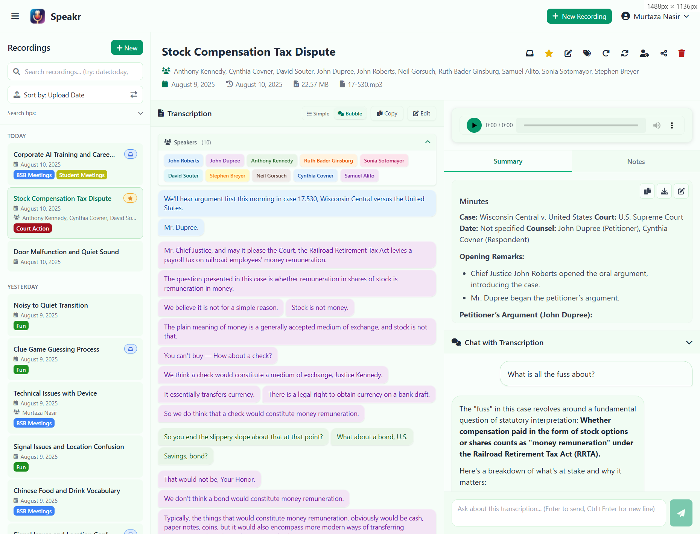
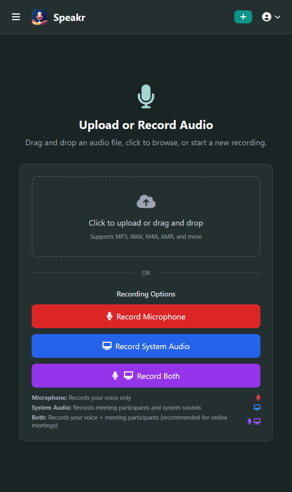
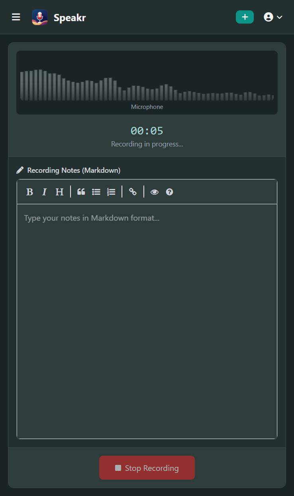
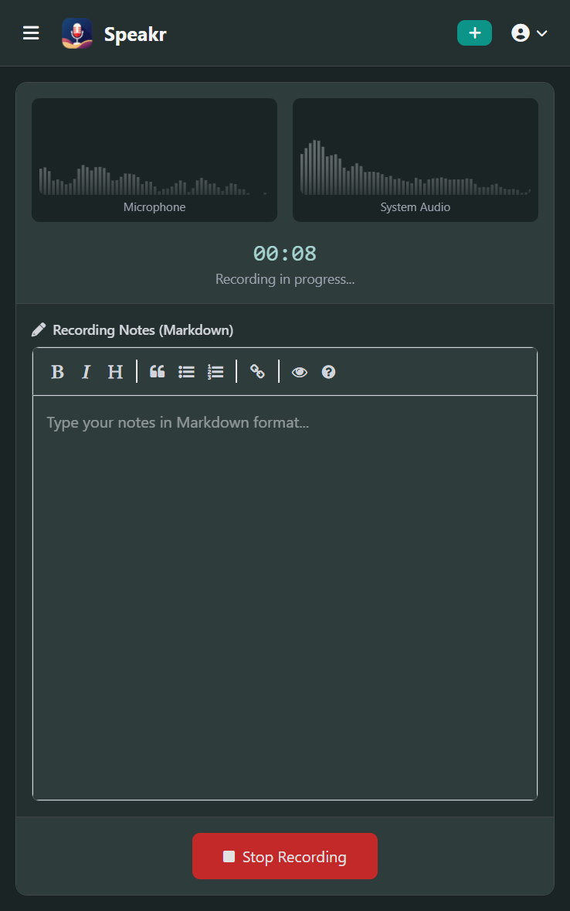

<div align="center">
    
</div>

<h1 align="center">Speakr</h1>
<p align="center">Self-hosted, intelligent note-taking for meetings and recordings</p>

<p align="center">
  <a href="https://www.gnu.org/licenses/agpl-3.0"></a>
  <a href="https://github.com/murtaza-nasir/speakr/actions/workflows/docker-publish.yml"></a>
</p>

> Speakr is an intelligent, self-hosted web application that transforms your audio recordings into organized, searchable, and insightful notes. By running on your own server, it ensures your sensitive conversations and data remain completely private.

> Designed for a wide range of uses, Speakr is trusted by professionals for meeting minutes, by therapists for session notes, by students for lecture capture, and even for transcribing D&D sessions. It automatically transcribes audio with speaker identification, generates concise summaries, and provides an AI chat interface to interact with your content.

<div align="center">
    
</div>

---

## What's New?

### Latest Release (Version 0.4.2)
* **Large File Chunking Support:** Automatically splits large audio files to work with transcription services that have file size limits (e.g., OpenAI's 25MB limit).
* **Optimized File Processing:** Improved efficiency by minimizing file conversions and using compressed formats.
* **Enhanced Security:** Strengthened CSRF protection and fixed session timeout issues.
* **Improved Recording Reliability:** Addressed several bugs related to in-browser recording.

<details>
<summary><strong>Previous Version History</strong></summary>

### Version 0.4.1 
* **Secure Sharing System:** Share transcriptions via public links with customizable permissions.
* **Enhanced Recording & Note-Taking:** Redesigned recording interface with a real-time notepad.
* **Advanced Speaker Diarization:** AI-powered speaker detection and saved speaker profiles.
* **"Black hole" Directory:** Feature for automatic, hands-free audio file processing.
* **Transcript Editing:** Manually edit and correct transcriptions.
* **Clickable Timestamps:** Navigate audio by clicking timestamps in the transcript.
* **Streaming Chat Responses:** More interactive and responsive AI chat.

</details>

---
## Screenshots


<div style="display: flex; justify-content: center; gap: 10px; flex-wrap: wrap;">
  
  
</div>

---
<details><summary><strong>Transcription & chat</strong></summary>
<div style="display: flex; justify-content: center;">
  <figure>
    
    <figcaption style="text-align: center;">Integrated Chat</figcaption>
  </figure>
</div>

<details><summary><strong>Light & dark</strong></summary>
<div style="display: flex; justify-content: space-around;">
  <figure>
    
    <figcaption style="text-align: center;">Light</figcaption>
  </figure>
  <figure>
    
    <figcaption style="text-align: center;">Dark</figcaption>
  </figure>
</div>
</details>
</details>

<details><summary><strong>Transcription views</strong></summary>
<div style="display: flex; justify-content: space-around; flex-wrap: wrap;">
  <figure>
    
    <figcaption style="text-align: center;">Simple</figcaption>
  </figure>
  <figure>
    
    <figcaption style="text-align: center;">Bubble</figcaption>
  </figure>
</div>
</details>

<details><summary><strong>Speaker identification</strong></summary>
<div style="display: flex; justify-content: space-around; flex-wrap: wrap;">
  <figure>
    
    <figcaption style="text-align: center;">AI-assisted</figcaption>
  </figure>
  <figure>
    
    <figcaption style="text-align: center;">Manual & Auto</figcaption>
  </figure>
  <figure>
    
    <figcaption style="text-align: center;">Saved Suggestions</figcaption>
  </figure>
</div>
</details>

<details><summary><strong>Recordings & notes</strong></summary>
<div style="display: flex; justify-content: space-around; flex-wrap: wrap;">
  <figure>
    
    <figcaption style="text-align: center;">Recording Options</figcaption>
  </figure>
  <figure>
    
    <figcaption style="text-align: center;">Mic/System Audio</figcaption>
  </figure>
  <figure>
    
    <figcaption style="text-align: center;">Mic + System Audio</figcaption>
  </figure>
</div>
</details>

</details>

---

## Core Features

* **Self-Hosted and Private:** Keep full control over your data by hosting Speakr on your own server.
* **Advanced Transcription & Diarization:** Get accurate transcripts with optional AI-powered speaker identification (diarization) to know who said what.
* **AI-Powered Insights:** Automatically generate titles and summaries for your recordings. Use the integrated chat to ask questions and pull insights directly from the transcript.
* **Install as a PWA App:** Install on your phone for quick and easy recordings and note capture. 
* **Versatile Recording & Upload:** Upload existing audio files or record directly in the browser or PWA app. Capture audio from your microphone, your system's audio (e.g., for an online meeting), or both simultaneously.
* **Automated Processing:** Designate a "black hole" directory for drag-and-drop batch processing of audio files.
* **Secure Sharing:** Create shareable links for your transcripts with granular controls, allowing you to include or exclude summaries and notes.
* **Customizable AI:** Configure the specific AI models, API endpoints (compatible with OpenAI, OpenRouter, local models), and custom prompts for summarization and chat.
* **Multi-User Support:** Includes a complete user management system with an admin dashboard.

<div style="display: flex; justify-content: center; gap: 10px; flex-wrap: wrap;">
    
    
    
</div>

---

## Getting Started

The recommended setup method uses Docker, which is simple and fast.

<details>
<summary><strong>Easy Setup: Docker Compose (Recommended)</strong></summary>

You only need Docker installed for this method; you do not need to clone the repository.

1.  **Create `docker-compose.yml`**
    Create a file named `docker-compose.yml` and add the following content:
    ```yaml
    services:
      app:
        image: learnedmachine/speakr:latest
        container_name: speakr
        restart: unless-stopped
        ports:
          - "8899:8899"
        env_file:
          - .env
        volumes:
          - ./uploads:/data/uploads
          - ./instance:/data/instance
    ```

2.  **Create Configuration (`.env`) File**
    Create a file named `.env` in the same directory. Your configuration will depend on whether you need speaker identification (diarization).

    * **Option A: Standard Whisper API (No Speaker Diarization)**
        This is the simplest method and works with any OpenAI Whisper-compatible API (like OpenAI, OpenRouter, or local LLMs).

        ```dotenv
        # --- Text Generation Model (uses /chat/completions endpoint) ---
        TEXT_MODEL_BASE_URL=[https://openrouter.ai/api/v1](https://openrouter.ai/api/v1)
        TEXT_MODEL_API_KEY=your_openrouter_api_key
        TEXT_MODEL_NAME=openai/gpt-4o-mini

        # --- Transcription Service (uses /audio/transcriptions endpoint) ---
        TRANSCRIPTION_BASE_URL=[https://api.openai.com/v1](https://api.openai.com/v1)
        TRANSCRIPTION_API_KEY=your_openai_api_key
        WHISPER_MODEL=whisper-1
        
        # --- Large File Chunking (for endpoints with file size limits) ---
        ENABLE_CHUNKING=true
        CHUNK_SIZE_MB=20

        # --- Application Settings ---
        ALLOW_REGISTRATION=false
        ADMIN_USERNAME=admin
        ADMIN_EMAIL=admin@example.com
        ADMIN_PASSWORD=changeme
        
        # --- Docker Settings ---
        SQLALCHEMY_DATABASE_URI=sqlite:////data/instance/transcriptions.db
        UPLOAD_FOLDER=/data/uploads
        ```

    * **Option B: ASR Webservice (With Speaker Diarization)**
        This method enables speaker identification but requires running a separate ASR webservice container. See the **Advanced Configuration** section below for details on setting up the ASR service.

        ```dotenv
        # --- Text Generation Model (uses /chat/completions endpoint) ---
        TEXT_MODEL_BASE_URL=[https://openrouter.ai/api/v1](https://openrouter.ai/api/v1)
        TEXT_MODEL_API_KEY=your_openrouter_api_key
        TEXT_MODEL_NAME=openai/gpt-4o-mini

        # --- Transcription Service (uses /asr endpoint) ---
        USE_ASR_ENDPOINT=true
        ASR_BASE_URL=http://your_asr_host:9000  # URL of your running ASR webservice
        ASR_DIARIZE=true
        ASR_MIN_SPEAKERS=1
        ASR_MAX_SPEAKERS=5

        # --- Application Settings ---
        ALLOW_REGISTRATION=false
        ADMIN_USERNAME=admin
        ADMIN_EMAIL=admin@example.com
        ADMIN_PASSWORD=changeme
        
        # --- Docker Settings ---
        SQLALCHEMY_DATABASE_URI=sqlite:////data/instance/transcriptions.db
        UPLOAD_FOLDER=/data/uploads
        ```

3.  **Start the Application**
    After editing your `.env` file with your API keys and settings, run the following command:
    ```bash
    docker compose up -d
    ```
    Access the application at `http://localhost:8899`. The admin user will be created on the first run.

</details>

<details>
<summary><strong>Advanced Setup: Build from Source</strong></summary>

Follow these steps if you want to modify the code or build the Docker image yourself.

1.  **Clone the Repository:**
    ```bash
    git clone [https://github.com/murtaza-nasir/speakr.git](https://github.com/murtaza-nasir/speakr.git)
    cd speakr
    ```
2.  **Create Configuration Files:**
    Copy the example files. Use `env.whisper.example` for the standard API method or `env.asr.example` for the ASR webservice method.
    ```bash
    cp docker-compose.example.yml docker-compose.yml
    cp env.whisper.example .env # Or cp env.asr.example .env
    ```
    Edit the `.env` file with your custom settings and API keys.

3.  **Build and Start:**
    ```bash
    docker compose up -d --build
    ```
</details>

---

## Usage Guide

1.  **Login:** Access the application (e.g., `http://localhost:8899`) and log in. The admin account is created from the `.env` variables on the first launch.
2.  **Set Preferences (Recommended):** Navigate to your **Account** page to set your default language, customize the AI summarization prompt, and add professional context to improve chat results.
3.  **Add a Recording:**
    * **Upload:** Drag and drop an audio file onto the dashboard or use the **New Recording** page.
    * **Record:** Use the in-browser recorder. You can record your mic, system audio, or both. **Note:** To capture system audio (e.g., from a meeting), you must share a **browser tab** or your **entire screen** and ensure the **"Share audio"** checkbox is enabled.
    * **Automated:** If enabled, simply drop files into the monitored "black hole" directory.

    <details>
    <summary><strong>Recording Interface Showcase</strong></summary>
    <div style="display: flex; justify-content: space-around; flex-wrap: wrap;">
      <figure>
        
        <figcaption style="text-align: center;">Recording Options</figcaption>
      </figure>
      <figure>
        
        <figcaption style="text-align: center;">Record from Phone/Computer Microphone</figcaption>
      </figure>
      <figure>
        
        <figcaption style="text-align: center;">Record Mic & System Audio (e.g., Zoom meeting)</figcaption>
      </figure>
    </div>
    </details>

4.  **Interact with Your Transcript:**
    * From the gallery, click a recording to view its details.
    * Read the transcript, listen to the audio, and review the AI-generated summary.
    * Edit metadata like titles and participants.
    * Use the **Chat** panel to ask questions about the content.
5.  **Identify Speakers (Diarization):**
    * If you used the ASR method with diarization enabled, click the **Identify Speakers** button.
    * In the modal, assign names to the detected speakers (e.g., `SPEAKER 00`, `SPEAKER 01`). You can use the **Auto Identify** feature to let the AI suggest names based on the conversation.

---

<details>
<summary><strong>Advanced Configuration & Technical Details</strong></summary>

**For detailed deployment instructions and information about the various API's used, see the [Deployment Guide](DEPLOYMENT_GUIDE.md#configuration-options)**

The recommended method is to use the pre-built Docker image, which is fast and simple. This is explained above. 

## Automated File Processing

Speakr includes a powerful "black hole" directory monitoring feature that automatically processes audio files without manual uploads. This is perfect for batch processing scenarios where you want to drop files into a directory and have them automatically transcribed.

### How It Works

1. **File Monitoring:** Speakr monitors a designated directory for new audio files
2. **Automatic Detection:** When new audio files are detected, they are automatically queued for processing
3. **File Stability Check:** Files are checked for stability (not being written to) before processing
4. **Automatic Processing:** Files are moved to the uploads directory and processed using your configured transcription settings
5. **Database Integration:** Processed recordings appear in your gallery with the title "Auto-processed - [filename]"

**For detailed instructions on setting this up, see the [Deployment Guide](DEPLOYMENT_GUIDE.md#automated-file-processing-black-hole-directory)**

</details>

-----

## License

This project is **dual-licensed**:

1.  **GNU Affero General Public License v3.0 (AGPLv3)**
    [](https://www.gnu.org/licenses/agpl-3.0)

    Speakr is offered under the AGPLv3 as its open-source license. You are free to use, modify, and distribute this software under the terms of the AGPLv3. A key condition of the AGPLv3 is that if you run a modified version on a network server and provide access to it for others, you must also make the source code of your modified version available to those users under the AGPLv3.

    * You **must** create a file named `LICENSE` (or `COPYING`) in the root of your repository and paste the full text of the [GNU AGPLv3 license](https://www.gnu.org/licenses/agpl-3.0.txt) into it.
    * Read the full license text carefully to understand your rights and obligations.

2.  **Commercial License**

    For users or organizations who cannot or do not wish to comply with the terms of the AGPLv3 (for example, if you want to integrate Speakr into a proprietary commercial product or service without being obligated to share your modifications under AGPLv3), a separate commercial license is available.

    Please contact **speakr maintainers** for details on obtaining a commercial license.

**You must choose one of these licenses** under which to use, modify, or distribute this software. If you are using or distributing the software without a commercial license agreement, you must adhere to the terms of the AGPLv3.

## Roadmap

Speakr is in active development. Planned features include a faster way to switch transcription languages on the fly.

## Contributing

Feedback, bug reports, and feature suggestions are highly encouraged\! Please open an issue on the GitHub repository to share your thoughts.

**Note on Code Contributions:** Should the project begin formally accepting external code contributions, a Contributor License Agreement (CLA) will be required. 