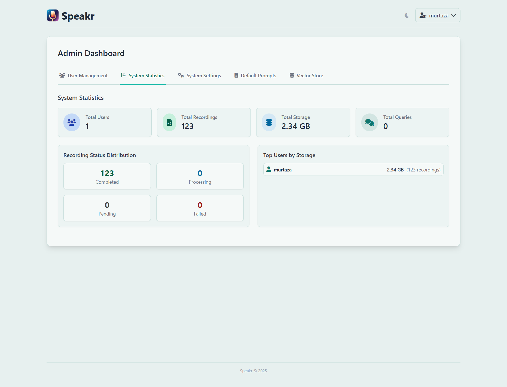

# System Statistics

The System Statistics tab transforms raw data into actionable insights about your Speakr instance. At a glance, you can see how many users you're serving, how many recordings they've created, how much storage they're consuming, and whether everything is processing smoothly.

## Key Metrics Overview

Four prominent cards at the top of the statistics page give you immediate insight into your system's scale. Total Users shows your current user base size, helping you understand your instance's reach. Total Recordings reveals the cumulative content in your system, while Total Storage presents the actual disk space consumed. Total Queries, when Inquire Mode is enabled, indicates how actively users are searching their recordings.

These numbers tell a story about your instance's health and growth. A growing user count with proportional recording growth suggests healthy adoption. Storage growing faster than recordings might indicate users are uploading longer files. Query counts reveal whether users are finding value in the semantic search features.

## Recording Status Distribution

The status distribution section breaks down your recordings into four critical states. Completed recordings are fully processed and ready for use - this should be the vast majority of your content. Processing recordings are currently being transcribed or analyzed. Pending recordings are queued and waiting their turn. Failed recordings encountered errors and need attention.

In a healthy system, you'll see mostly completed recordings with perhaps a few processing at any given moment. A large number of pending recordings might indicate your system is overwhelmed or that background processing has stopped. Failed recordings always deserve investigation - they might reveal configuration issues, API problems, or corrupted files that users are trying to upload.

## Storage Analysis

The "Top Users by Storage" section reveals who's consuming the most resources in your system. Each user is listed with their total storage consumption and recording count, giving you context about whether they have many small files or fewer large ones.

This information proves invaluable for capacity planning and user education. If one user consumes disproportionate storage, you might need to understand their use case better. Are they recording multi-hour meetings? Keeping everything forever? Understanding the why behind the numbers helps you make better policy decisions.

## Understanding Usage Patterns

Statistics aren't just numbers - they're insights waiting to be discovered. Sudden spikes in recordings might coincide with project kickoffs, academic semesters, or company initiatives. Storage growth that outpaces recording growth could indicate users are uploading longer content or higher quality audio files.

Regular monitoring helps you spot trends before they become problems. If storage grows 10% monthly, you can project when you'll need to expand capacity. If failed recordings suddenly spike, you can investigate whether an API key expired or a service is down.

## Capacity Planning

System statistics are your crystal ball for infrastructure needs. Storage growth trends tell you when you'll need more disk space. User growth patterns indicate when you might need to scale your server resources. Processing queues reveal whether your current setup can handle the workload.

Use these insights proactively. If you see storage growing at 50GB monthly and you have 200GB free, you know you have about four months before needing intervention. This lead time lets you budget for upgrades, plan migrations, or implement retention policies before hitting critical limits.

---

Next: [System Settings](system-settings.md) →