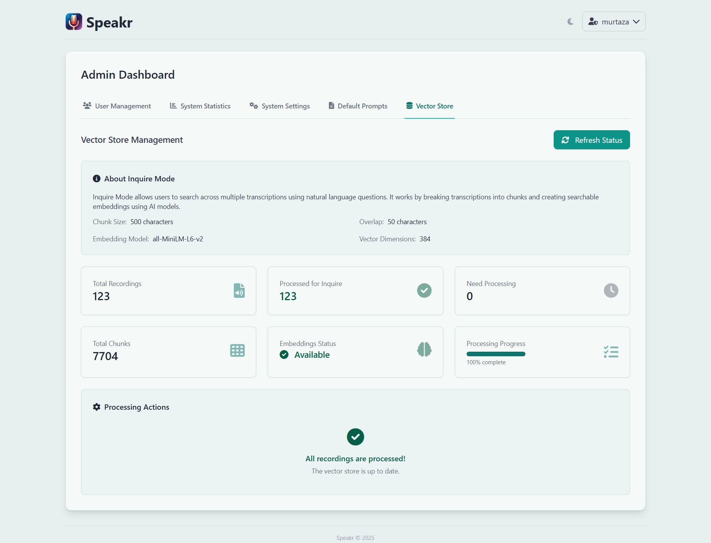

# Vector Store Management

The Vector Store tab controls the intelligence behind Inquire Mode, Speakr's semantic search capability that lets users find information across all their recordings using natural language questions. This is where you monitor and manage the embedding system that transforms transcripts into searchable knowledge.

## Understanding Inquire Mode

Before diving into management, it's worth understanding what you're managing. Inquire Mode breaks each transcript into overlapping chunks of text, converts these chunks into mathematical representations called embeddings, and stores them in a searchable format. When users ask questions, their query gets converted to the same mathematical format and compared against all stored chunks to find the most relevant information.

This approach goes beyond simple keyword matching. The system understands that "budget concerns" relates to "financial constraints" and "cost overruns" even though the exact words differ. This semantic understanding makes Inquire Mode powerful for discovering information that users might not remember precisely.

## The Embedding Model

Your Speakr instance uses the all-MiniLM-L6-v2 model, shown prominently in the interface. This model generates 384-dimensional vectors - imagine each chunk of text mapped to a point in 384-dimensional space where similar meanings cluster together.

This specific model was chosen carefully. Larger models exist with better accuracy, but they require GPUs and significant computational resources. The MiniLM model runs efficiently on CPU-only systems, making advanced search accessible without expensive infrastructure. It processes text quickly, understands context well, and produces compact embeddings that don't overwhelm your storage.

The model works best with English text, as that's what dominated its training data. Other languages may work with varying success, but English content will always produce the most reliable results. This limitation is a trade-off for the model's efficiency and accessibility.

## Processing Status Overview

The status cards give you immediate insight into your vector store's health. Total Recordings shows how many audio files exist in your system, while Processed for Inquire indicates how many have been converted to searchable embeddings. These numbers should eventually match, though there's often a lag as background processing catches up.

Need Processing reveals recordings waiting for embedding generation. This number grows when users upload new content and shrinks as the background processor works through the queue. A consistently high number might indicate processing has stalled or your system is overwhelmed.

Total Chunks shows the granular pieces your recordings have been divided into. A typical one-hour recording might generate 50-60 chunks, depending on transcript density. This chunking ensures relevant segments can be found even in very long recordings.

The Embeddings Status indicator provides a quick health check. "Available" in green means everything is working correctly. Other states might indicate the model is loading, processing is running, or attention is needed.

## Processing Progress

The processing progress bar shows real-time advancement through the embedding queue. When at 100%, all recordings are processed and searchable. Lower percentages indicate work in progress, with the bar filling as recordings are completed.

This visual feedback helps you understand system status at a glance. A stuck progress bar suggests processing has stopped. Slow progress might indicate system resource constraints. Rapid progress shows everything is working efficiently.

## Managing the Processing Queue

The Refresh Status button updates all statistics and progress indicators, useful for monitoring active processing or verifying recent uploads have been queued. The interface doesn't auto-refresh, so manual refreshes ensure you're seeing current information.

When the system shows recordings need processing but progress isn't advancing, several factors might be at play. The background processor might have stopped, the embedding model might have failed to load, or system resources might be exhausted. Check your logs for specific error messages.

The processing system is designed to be resilient. If processing fails for a specific recording, the system marks it and moves on rather than getting stuck. These failures appear in your logs and might require manual intervention to resolve.

## Optimizing Performance

Processing performance depends heavily on your system resources. The embedding model needs about 500MB of RAM when loaded, plus additional memory for processing text. CPU speed directly impacts how quickly embeddings are generated - a modern multi-core processor can handle several recordings simultaneously.

Disk I/O also matters. The system reads transcripts, processes them, and writes embeddings back to the database. Fast storage, particularly SSDs, significantly improves processing throughput. If your vector store is on a different disk than your transcripts, ensure both have adequate performance.

Network latency shouldn't affect processing since everything happens locally, but database performance matters. Regular database maintenance, including index optimization and vacuum operations, keeps queries fast even as your vector store grows.

## Troubleshooting Common Issues

When Inquire Mode returns poor results despite processed recordings, the issue might be query formulation rather than the vector store. Encourage users to ask complete questions rather than typing keywords. "What did John say about the budget?" works better than just "John budget."

If processing seems frozen, check whether the sentence-transformers library is properly installed. The system gracefully degrades without it, disabling Inquire Mode rather than crashing, but processing won't advance. Your logs will show whether the embedding model loaded successfully.

Memory errors during processing usually indicate your system is trying to process too much simultaneously. The chunking system prevents individual recordings from overwhelming memory, but processing multiple large recordings in parallel might exceed available RAM.

## Scaling Considerations

The vector store grows predictably with your content. Each chunk requires about 2KB of storage for its embedding and metadata. A typical one-hour recording generating 50 chunks needs about 100KB of embedding storage. Ten thousand hours of recordings might require 100MB for embeddings - manageable even on modest systems.

Search performance remains fast even with large vector stores thanks to efficient indexing. However, extremely large instances (hundreds of thousands of recordings) might benefit from dedicated vector database solutions rather than the built-in SQLite storage.

If your instance grows beyond comfortable limits, consider archiving old recordings. The vector store only includes active recordings, so removing obsolete content improves both storage and search performance.

---

Return to [Admin Guide Overview](index.md) →