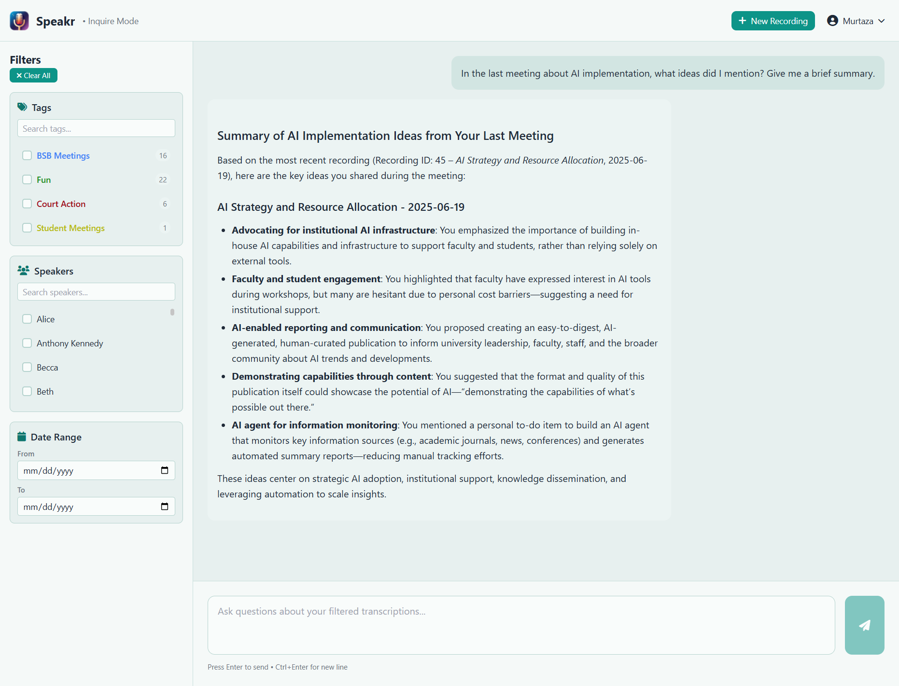

# Inquire Mode - Semantic Search

Inquire Mode transforms your entire recording library into an intelligent knowledge base that you can search using natural language questions. Instead of hunting through individual recordings or trying to remember which meeting contained a specific discussion, you can simply ask questions and receive comprehensive answers drawn from all your relevant recordings.

## Understanding Inquire Mode

Think of Inquire Mode as having a knowledgeable assistant who has listened to every recording in your library and can instantly recall and synthesize information from any of them. When you ask a question, the system searches across all your transcriptions, understands the context and meaning behind your query, and provides a coherent answer with citations back to the source recordings.

This semantic search capability goes far beyond simple keyword matching. The system understands concepts, relationships, and context. If you ask about "budget concerns," it will find discussions about financial constraints, cost overruns, funding issues, and resource limitations - even if the exact phrase "budget concerns" was never spoken.

## Getting Started with Inquire Mode

Access Inquire Mode by clicking the Inquire button in the top navigation bar. The interface opens with a clean search area at the top and powerful filtering options on the left side. Your search results appear in the main content area, organized and formatted for easy reading.

The beauty of Inquire Mode is its simplicity. You don't need to learn special search syntax or commands. Just type your question as you would ask a colleague, and the system handles the complexity of finding and synthesizing the relevant information.

## Using Filters to Focus Your Search

The left sidebar contains filters that help you narrow your search to specific recordings before asking your question. This is particularly useful when you have a large library and want to focus on certain contexts.

The tag filter lets you select recordings with specific tags, which is perfect when you want to search within a particular project, client, or type of meeting. If you've tagged your recordings consistently, this becomes a powerful way to segment your searches. The system shows how many recordings match each tag, helping you understand the scope of your search.

Speaker filtering allows you to focus on what specific people have said across recordings. This is invaluable when you need to track commitments from a particular person, understand someone's perspective on various topics, or prepare for a meeting with specific individuals.

Date range filtering helps you focus on recent discussions or search within a specific time period. This is particularly useful for tracking how discussions have evolved over time or finding information from a specific quarter or project phase.

## Asking Effective Questions

The key to getting great results from Inquire Mode is asking clear, specific questions. The system works best when you provide context and be specific about what you're looking for.

Instead of searching for single words like "deadline," ask complete questions like "What are the upcoming deadlines for the mobile app project?" This helps the AI understand not just what information you want, but why you want it and how to present it most usefully.

The system excels at different types of queries. You can ask for summaries of specific topics across multiple meetings, request lists of action items or decisions, search for specific statements or commitments, analyze patterns or trends in discussions, or identify problems and proposed solutions.

## Understanding Your Results

When Inquire Mode returns results, it provides a synthesized answer that draws from all relevant recordings. The response isn't just a list of search hits - it's a coherent narrative that combines information from multiple sources into a unified answer.

Each piece of information includes a citation in the format (Recording ID: XX) that links directly to the source recording. Clicking these links takes you to the full recording where you can see the complete context. This transparency ensures you can always verify the information and dive deeper when needed.

The system intelligently organizes information, grouping related points together and presenting them in a logical flow. If multiple recordings discuss the same topic, the answer will synthesize these discussions, showing how the conversation evolved over time while maintaining clear attribution to each source.

## Practical Applications

Inquire Mode shines in numerous real-world scenarios. When preparing for meetings, you can quickly review what was previously discussed about agenda topics, what questions remained unresolved, and what commitments were made. This ensures you walk into meetings fully informed without spending hours reviewing old recordings.

For project management, the system helps track decisions across multiple meetings, identify all action items assigned to team members, and monitor how project requirements or priorities have changed over time. You can ask questions like "What risks have been identified for the product launch?" and receive a comprehensive list drawn from all relevant discussions.

Research and analysis become dramatically more efficient. Whether you're analyzing customer feedback patterns, tracking competitor mentions, or identifying recurring themes across interviews, Inquire Mode can surface insights that might otherwise remain buried in hours of recordings.

The system also serves as an excellent compliance and documentation tool. You can quickly find specific commitments made to clients, locate discussions about regulatory requirements, or verify what was agreed upon in negotiations. The citation system provides an audit trail back to the original recordings.

## Advanced Search Strategies

As you become more comfortable with Inquire Mode, you can develop sophisticated search strategies. Start with broader questions to understand the landscape of available information, then drill down with increasingly specific queries. This iterative approach helps you discover information you might not have known to ask about directly.

Combine filters strategically. For instance, when preparing for a client meeting, filter by that client's tag and the relevant date range, then ask about outstanding issues or commitments. This focused approach yields highly relevant results without noise from unrelated recordings.

Pay attention to how the system interprets your questions. If results aren't quite what you expected, try rephrasing with different terms or adding more context. The system learns from the patterns in your recordings, so using terminology consistent with your actual discussions often yields better results.

## Technical Considerations

Inquire Mode's power comes from its semantic understanding capabilities. When embeddings are enabled (with sentence-transformers installed), the system creates mathematical representations of meaning that allow it to understand concepts beyond simple keyword matching. This means it can find relevant information even when different words are used to express the same ideas.

Speakr uses the all-MiniLM-L6-v2 embedding model, a deliberately lightweight choice that balances performance with resource efficiency. This model generates 384-dimensional vectors and runs comfortably on CPU-only systems, which is crucial since most Speakr deployments are on standard servers or personal machines without dedicated GPUs. While newer, larger embedding models exist, they would require significantly more computational resources and could make the system sluggish or unusable on typical hardware. The MiniLM model provides excellent semantic understanding for conversational content while remaining fast and responsive even when processing hundreds of recordings.

The system processes recordings in chunks, allowing it to search through even very long recordings efficiently. Each chunk is analyzed independently but results are synthesized to maintain context and continuity. This approach ensures both speed and accuracy, even with large recording libraries.

Performance scales well with proper setup. The initial indexing of recordings happens automatically after transcription, and subsequent searches leverage this pre-computed index. Response times typically range from a few seconds for focused searches to slightly longer for complex queries across large libraries.

## Making the Most of Inquire Mode

To maximize the value of Inquire Mode, maintain good recording hygiene. Ensure your recordings have clear audio quality for accurate transcription, use speaker identification to track who said what, and apply consistent tags to organize your content. The better your input data, the more powerful your searches become.

Take advantage of the iterative nature of search. Start with a general question, review the results, then ask follow-up questions to drill deeper. The system maintains context within a session, making it easy to refine your search based on initial results.

Remember that Inquire Mode complements, not replaces, the standard recording interface. Use Inquire Mode for discovery and synthesis across recordings, but when you need deep focus on a single recording, the standard transcription view with its chat interface might be more appropriate.

## Limitations to Keep in Mind

While powerful, Inquire Mode has boundaries. It searches only transcribed text, not audio directly, so any errors in transcription will affect search results. The system cannot infer information that isn't explicitly stated in recordings - it finds and synthesizes what was said, not what was meant but left unsaid.

Language support is optimized for English, as the embedding model (all-MiniLM-L6-v2) was primarily trained on English text. Other languages may work with varying degrees of success. Very long recordings might be summarized rather than fully indexed if they exceed processing limits. The system requires recordings to be fully processed before they're searchable, so very recent recordings might not appear immediately in results.

---

Next: [Sharing Recordings](sharing.md) →