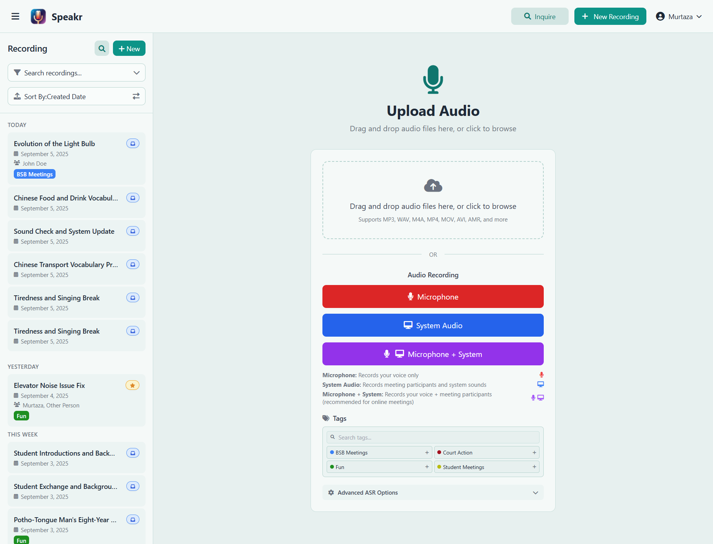
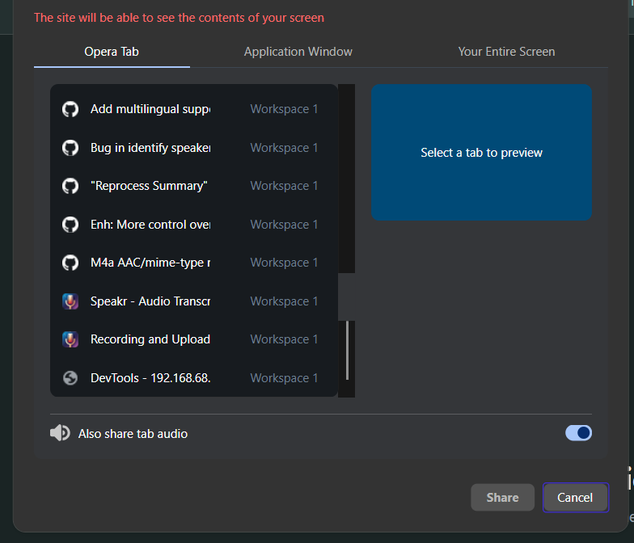
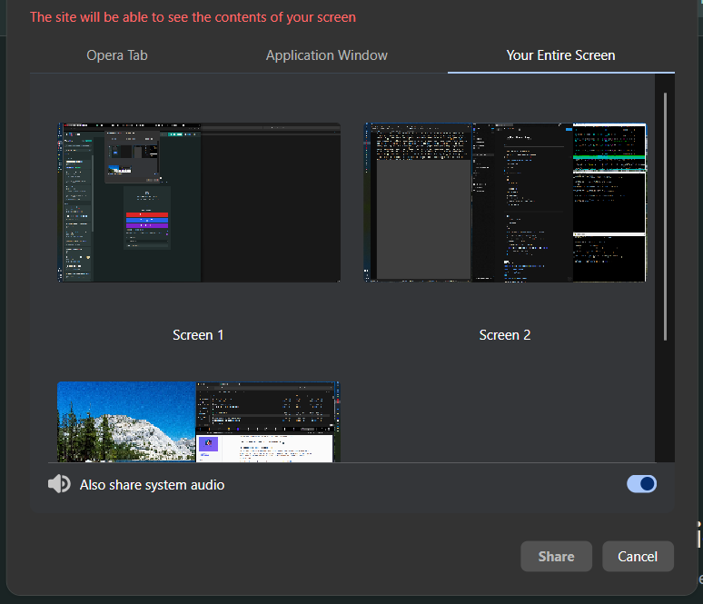
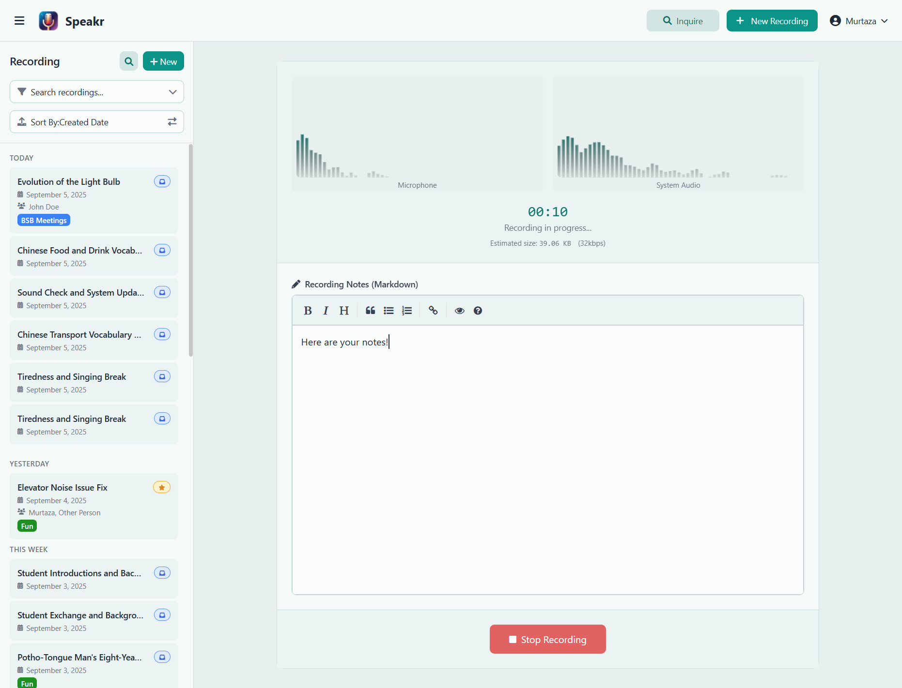
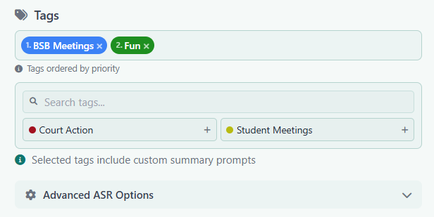

# Recording and Uploading Audio

Speakr provides two powerful ways to add content to your library: uploading existing audio files for transcription or recording new audio directly in your browser. Both methods include the same powerful features for organization, [tagging](settings.md#tag-management-tab), and processing. After recording, you can [work with transcriptions](transcripts.md) and use [AI features](../features.md#ai-powered-intelligence).

## Important: Browser Requirements for Recording

Before you start recording, it's crucial to understand that browser security features can affect your ability to record audio, especially system audio. For security reasons, most browsers require HTTPS connections for audio recording features. If you're accessing Speakr locally (not via localhost), you may need to configure your browser to allow audio recording on HTTP connections. Detailed browser configuration instructions are provided at the bottom of this page.

When recording system audio, you'll need to grant screen sharing permissions and specifically enable the "Also share system audio" option. Without this, only your microphone will be recorded. Different browsers may phrase this option differently, but it's essential for capturing computer audio.

## Accessing the New Recording Screen

Click the "+ New Recording" button in the top navigation bar to access the recording interface. This opens a dedicated screen where you can either upload files or start a live recording.

## Uploading Audio Files

The upload interface provides a simple drag-and-drop area at the top of the screen. You can either drag audio files directly from your file manager onto this area, or click the area to open a file browser and select files.

Speakr supports a [wide range of audio and video formats](../faq.md#what-audio-formats-does-speakr-support). Common audio formats like MP3, WAV, M4A, FLAC, AAC, and OGG work perfectly. You can also upload video files including MP4, MOV, and AVI, and Speakr will extract and process the audio track. Mobile recordings in formats like AMR, 3GP, and 3GPP are also supported. The default file size limit is 500MB, though this can be configured by your administrator in [system settings](../admin-guide/system-settings.md#maximum-file-size). For files over 25MB with OpenAI, see [chunking configuration](../troubleshooting.md#files-over-25mb-fail-with-openai).

When you upload a file, it immediately appears in the upload queue with a progress bar showing the upload status. Once uploaded, you can add [tags](settings.md#tag-management-tab), set a custom title, and configure processing options before starting transcription. Tags can include [custom AI prompts](../admin-guide/prompts.md) for specialized processing.

## Recording Live Audio

Below the upload area, you'll find the audio recording section with three distinct recording modes, each designed for different scenarios:

### Microphone Recording

The red microphone button captures audio from your selected microphone. This mode is perfect for recording in-person meetings, personal voice notes, or interviews. When you click this option, your browser will request microphone permission if it hasn't been granted already. You can select which microphone to use if you have multiple input devices connected.

### System Audio Recording

The blue system audio button captures all sound playing through your computer. This is ideal for recording online meetings when you're primarily listening, webinars, video presentations, or any audio content playing on your computer. This feature uses the browser's screen capture API, so you'll need to select which screen or application to share when you start recording. Make sure to check the "Share system audio" checkbox in the sharing dialog.

### Combined Recording (Microphone + System)

The purple combined button records both your microphone and system audio simultaneously into a single synchronized track. This is the recommended mode for online meetings where you're an active participant, as it captures both sides of the conversation. The system intelligently mixes both audio sources, ensuring clear recording of both your voice and the meeting audio.

## How to Enable System Audio Recording

When you click to record system audio (or both microphone and system), your browser will display a screen sharing dialog. This might seem confusing at first since you want to record audio, not share your screen, but this is how browsers provide access to system audio.

### Recording from a Browser Tab

Choose the tab option if the audio you want to record is playing within a specific browser tab, such as a YouTube video, web-based meeting platform (like Google Meet or browser-based Zoom), or online training video.

When selecting a tab, you'll see a preview of all your open tabs. Choose the tab containing your audio source, then make sure to enable the **"Also share tab audio"** checkbox at the bottom of the dialog. This checkbox is critical - without it enabled, you'll only record silence. The exact wording may vary by browser (Chrome might say "Share tab audio" while Edge might phrase it slightly differently), but there will always be an audio-related checkbox that must be checked.

This option will only capture audio from that specific tab, so make sure all the audio you're interested in is within that single tab before starting your recording.

### Recording from Your Entire Screen

Choose the screen option if the audio you want to record is coming from desktop applications or multiple sources.

This is the recommended option when recording:
- Desktop applications like Zoom client, Microsoft Teams, Skype, or Discord
- Audio from multiple browser tabs simultaneously
- System sounds or notifications you want to capture
- Any combination of audio sources on your computer

When you select "Your Entire Screen", you'll see previews of all your available screens (if you have multiple monitors). It doesn't matter which screen you choose since Speakr only records audio, not video. The critical step is to enable the **"Also share system audio"** checkbox at the bottom of the dialog. Without this checkbox enabled, you'll only record silence.

**Important macOS Limitation:** The "Also share system audio" option is available on Windows and Linux, but may not be available on macOS due to operating system limitations. macOS users may only be able to record audio from browser tabs, not from the entire system or desktop applications. This is a limitation imposed by macOS's security model, not by Speakr or your browser.

## During Recording - Live Interface

Once you start recording, the interface transforms to show the active recording session:

 and take markdown notes.png)

### Real-Time Audio Monitoring

The recording interface displays live audio visualizers for each active input source. When recording from your microphone, you'll see a real-time waveform showing your voice levels. For system audio recording, a separate visualizer displays the computer audio levels. These visualizers help you confirm that audio is being captured properly and at appropriate levels.

A prominent timer at the top shows the elapsed recording time in minutes and seconds, updating in real-time. Below the timer, you'll see an estimate of the file size based on the current recording duration and quality settings. This helps you stay aware of how much storage space your recording will require.

### Live Note-Taking with Markdown

One of Speakr's most powerful features is the ability to take structured notes while recording. The note-taking area appears below the audio visualizers and supports full markdown formatting.

The markdown editor includes a formatting toolbar with buttons for common formatting options like bold, italic, headers, quotes, lists, and links. You can also type markdown syntax directly if you prefer. The editor supports all standard markdown elements, allowing you to create well-structured notes that complement your recording.

Your notes are saved automatically and will be associated with the recording. They appear in the Notes tab when viewing the recording later and are fully searchable alongside the transcription. This makes it easy to capture important context, decisions, or action items that might not be explicitly stated in the audio.

Common use cases for live notes include capturing action items and deadlines during meetings, noting important timestamps for later reference, recording participant names and roles, documenting decisions and their rationale, and adding context that might not be clear from the audio alone.

## Finalizing Your Recording

After stopping a recording or selecting an uploaded file, you'll see the finalization screen where you can add metadata and configure processing options:

### Adding Tags

The tag system is one of Speakr's most powerful organizational features. Tags appear as colored pills that you can select to categorize your recording. You can apply multiple tags to a single recording, making it easy to cross-reference content across different categories.

It's important to select relevant tags before uploading your file so that the appropriate summary prompts are applied during summarization. Each tag can have custom AI prompts associated with it, which influence how the summary is generated. For example, a "Meeting" tag might focus the summary on action items and decisions, while a "Lecture" tag might emphasize key concepts and learning points.

**Intelligent Prompt Stacking:** When you select multiple tags, their associated prompts are concatenated in the order you select them, allowing for intelligent stacking of instructions. This powerful feature lets you combine general and specific prompts. For instance, you might have a standard "Meetings" tag with general meeting instructions, then add a project, client, or situation specific tag that adds additional context and instructions for the summarization. The AI will apply both sets of instructions by concatenating general meeting requirements with the specific modifications. This allows you to create sophisticated summarization rules without having to create a separate tag for every possible combination. To create and manage tags with custom prompts, see [Tag Management in Account Settings](settings.md#tag-management-tab).

As shown in the interface, if you add tags that include summarization instructions, you will get an indication of this in the UI. The order matters - select your primary tag first, then add modifying tags to layer additional instructions. Tags are also searchable and filterable in the main view, making it easy to find related recordings later.

### Advanced ASR Options

If your administrator has configured ASR endpoints with speaker diarization, you'll see an expandable "Advanced ASR Options" section. Here you can specify the transcription language if your content is not in English, set the minimum and maximum number of expected speakers for better diarization accuracy, and configure other ASR-specific settings based on your setup.

These settings are particularly useful for meetings with known participants, as setting accurate speaker counts improves the AI's ability to separate different voices in the transcription.

### Final Actions

At the bottom of the modal, you have three options for proceeding. The "Upload" or "Start Processing" button begins transcription immediately with your selected settings. The recording will appear in your library with a processing indicator while transcription runs in the background. The "Discard" option deletes the recording without saving, useful if you made a test recording or captured the wrong content. Some configurations may also offer a "Save Draft" option to store the recording without processing it immediately.

## Best Practices for Quality Recordings

### Optimizing Audio Quality

The quality of your transcription starts with the quality of your recording. When using a microphone, find a quiet space with minimal echo and background noise. Soft furnishings and carpeted rooms generally provide better acoustics than empty rooms with hard surfaces. Position your microphone consistently, about 6-12 inches from your mouth, and speak at a steady volume.

**Important Note for Phone Recordings:** Many smartphones have aggressive noise cancellation algorithms designed to enhance single-speaker calls. When recording meetings or conversations with multiple speakers using a phone's microphone, these noise cancellation features may incorrectly identify other speakers as background noise and filter them out. This can result in muffled or missing audio from speakers who are farther from the phone. This is not a limitation of Speakr but rather how modern phones process audio. For multi-speaker recordings, consider using an external microphone without noise cancellation or positioning the phone equidistant from all speakers.

For system audio recording, close unnecessary applications that might produce notification sounds or background audio. If you're recording a video call, ensure you have a stable internet connection to avoid audio dropouts. Using wired internet instead of WiFi can improve stability for important recordings.

When recording both microphone and system audio, use headphones to prevent echo and feedback. This ensures that the system audio doesn't get picked up by your microphone, which would create a confusing double recording.

### Effective Organization from the Start

Develop a consistent approach to naming and tagging your recordings. Include key information in titles such as the meeting type, main topic, or project name. If the original meeting date is different from the upload date, make sure you update the meeting date on upload, making chronological sorting easier.

Apply tags before or immediately after recording while the context is fresh in your mind. Consider creating a standard set of tags for different types of content like meetings, lectures, interviews, or personal notes. If your organization uses specific project codes or client names, incorporate these into your tagging system.

Take advantage of the live note-taking feature to capture information that might not be clear from audio alone. Note participant names at the beginning of meetings, mark important timestamps when key decisions are made, and document any visual information that was shared but won't be captured in the audio.

## Browser Configuration for Local Deployments

### System Audio Recording Requirements

System audio recording requires specific browser support and configuration. The feature works best in Chrome and other Chromium-based browsers like Edge or Brave. Firefox has limited support, and Safari currently doesn't support system audio recording at all.

For production deployments using HTTPS, audio recording works without additional configuration. However, if you're accessing Speakr over HTTP (except for localhost), you'll need to configure your browser to allow audio recording on insecure connections.

### Chrome Configuration for HTTP Access

If you're accessing Speakr over HTTP (not localhost), Chrome will block audio recording by default. To enable it:

1. Open Chrome and navigate to `chrome://flags`
2. Search for "Insecure origins treated as secure"
3. In the text field, enter your Speakr URL (e.g., `http://192.168.1.100:8899`)
4. Set the dropdown to "Enabled"
5. Click "Relaunch" to restart Chrome with the new settings

This configuration tells Chrome to treat your specific HTTP URL as if it were secure, enabling all audio recording features.

### Firefox Configuration for HTTP Access

Firefox requires a different approach to enable microphone access on HTTP sites:

1. Open Firefox and navigate to `about:config`
2. Click "Accept the Risk and Continue" when warned
3. Search for `media.devices.insecure.enabled`
4. Double-click the setting to change it from `false` to `true`
5. Restart Firefox for the change to take effect

Note that even with this setting, Firefox's system audio capture may not work reliably. For system audio recording, Chrome is strongly recommended.

### Security Considerations

These browser configurations reduce security and should only be used for local development or trusted internal networks. For production deployments, always use HTTPS with proper SSL certificates. This ensures all browser features work correctly and maintains security for your users.

### Common Issues and Solutions

If your microphone isn't detected, first check that your browser has permission to access it. Click the padlock or information icon in the address bar and ensure microphone access is allowed. Verify your microphone is properly connected and selected as the default input device in your system settings. If problems persist, try using a different browser or restarting your current browser.

When system audio recording isn't working, the most common issue is forgetting to check the "Also share system audio" checkbox when selecting what to share. This checkbox appears at the bottom of the screen/tab selection dialog and must be enabled. Make sure you're selecting either the entire screen or a browser tab, not an individual application window, as application audio sharing is often not supported.

If you're on a locally hosted instance and can't record audio, check whether you're accessing Speakr via HTTP. Browsers block audio recording on insecure connections for security reasons. Either set up HTTPS with a reverse proxy or configure your browser using the instructions above to allow audio recording on your specific HTTP URL.

If a recording stops unexpectedly, check your available disk space as browsers have limits on local storage. Ensure your internet connection is stable, especially if you have auto-save features enabled. Check the browser's developer console (F12) for any error messages that might indicate the problem.

For poor audio quality issues, start by checking your microphone placement and gain settings. External USB microphones often provide better quality than built-in laptop microphones. Reduce background noise by closing windows, turning off fans, and muting other devices. If recording system audio, ensure the source audio quality is good, as Speakr can't improve poor source audio.

## Moving Forward

Now that you understand how to create and upload recordings, you're ready to explore how to work with transcriptions and leverage Speakr's AI-powered features for summarization and chat.

---

Next: [Working with Transcriptions](transcripts.md) →