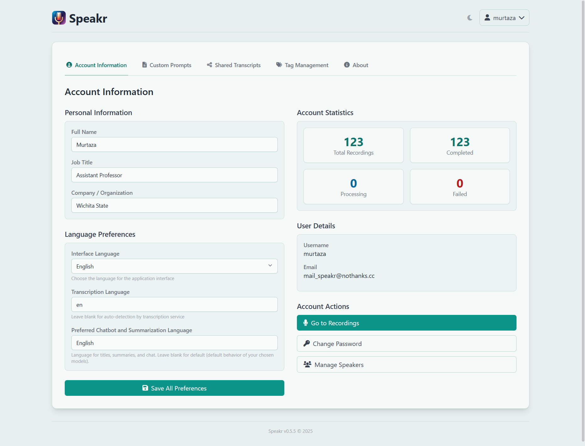
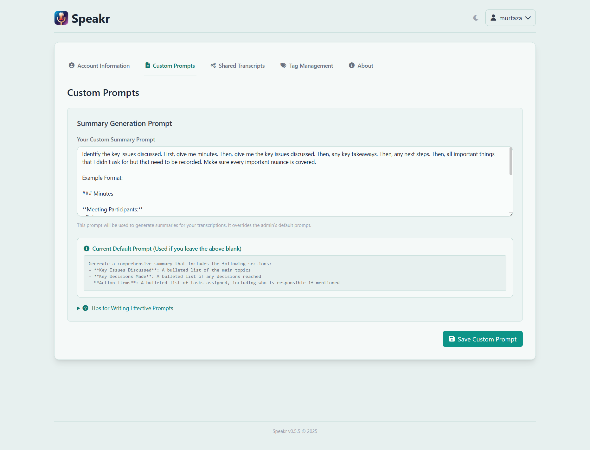
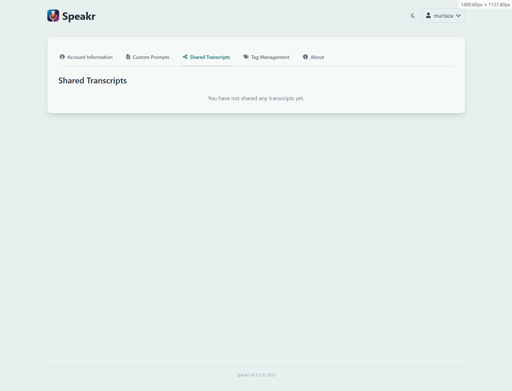
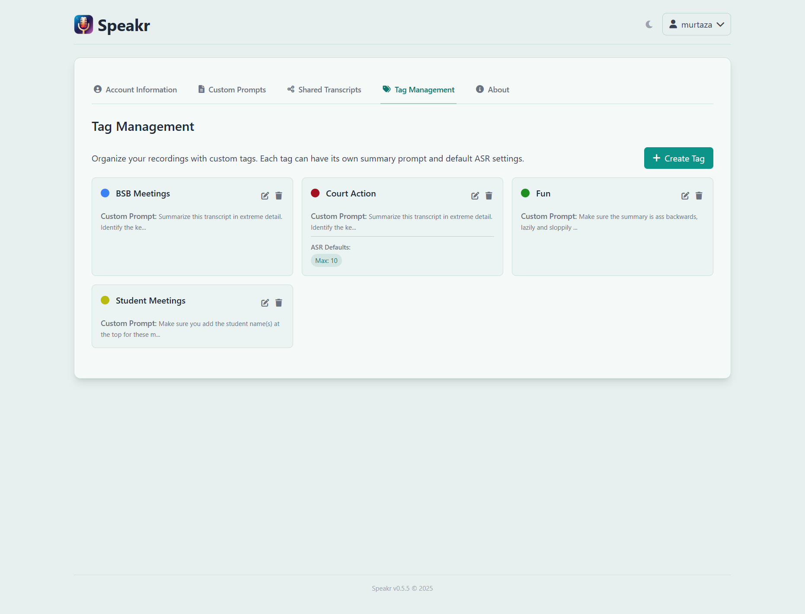
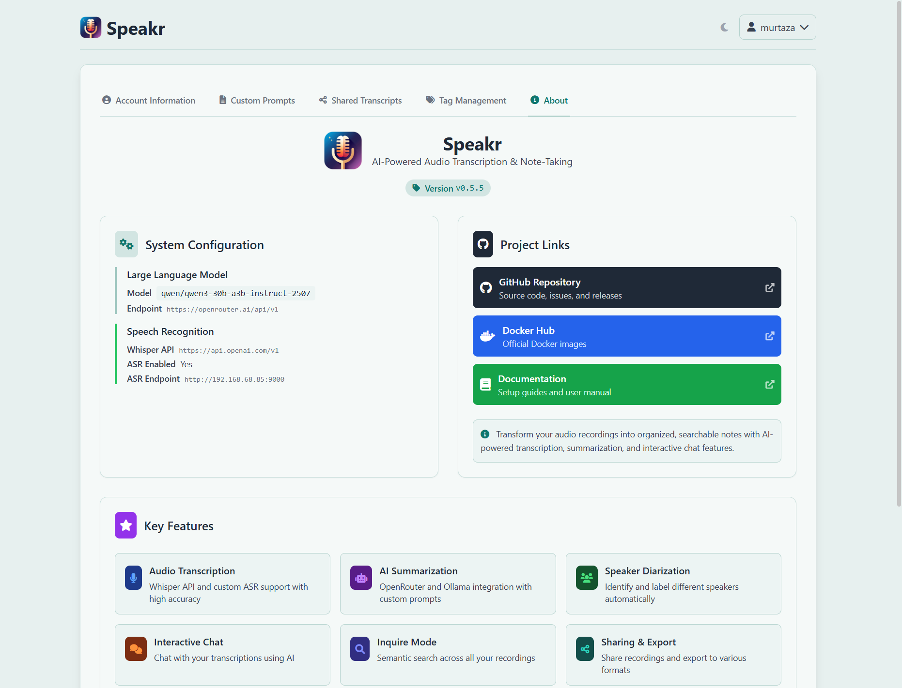

# Account Settings

Your account settings are the control center for personalizing Speakr to work exactly how you need it. Every preference you set here shapes your daily experience, from the language you see to how AI summarizes your recordings. Access these settings by clicking your username in the top navigation and selecting Account.

## Account Information Tab

The Account Information tab presents a comprehensive view of your profile, statistics, and account actions.

### Personal Information

On the left side, you'll find fields to update your full name, job title, and company or organization. These details help identify you in collaborative environments and provide context for your recordings. Keeping these current ensures colleagues can recognize your contributions and administrators can manage users effectively.

### Language Preferences

Three distinct language settings shape your entire Speakr experience. The interface language dropdown immediately transforms all menus, buttons, and messages to your chosen language - English, Spanish, French, Chinese, or German. The transcription language field accepts ISO language codes like "en" or "es" to optimize recognition accuracy, though leaving it blank enables automatic detection for multilingual content. The preferred chatbot and summarization language ensures all AI-generated content appears in your chosen language, regardless of the source audio's language.

### Account Statistics

The right side displays your recording metrics at a glance. You'll see your total recordings count and how many have been completed processing. Below that, the number of recordings currently processing and any that have failed provide immediate insight into your content status.

### User Details

Your username and email address appear here as read-only fields. The email serves as your login credential and cannot be changed without administrator assistance.

### Account Actions

The account actions section provides quick access to essential functions. The prominent "Go to Recordings" button takes you directly to your recording library. The "Change Password" button opens a secure dialog for updating your credentials. The "Manage Speakers" link provides a shortcut to speaker profile management, though this functionality is also accessible via its dedicated tab.

## Custom Prompts Tab

The Custom Prompts tab unlocks one of Speakr's most powerful features - the ability to shape how AI interprets and summarizes your recordings.

### Your Custom Summary Prompt

The large text area accepts detailed instructions in natural language that become the AI's instruction set. Think of it as teaching an assistant exactly how you want meeting notes prepared. You might request specific sections like "Key Technical Decisions" for engineering meetings or "Patient Observations" for medical consultations.

### Current Default Prompt

Below your custom prompt area, you'll see the default prompt that applies when you leave yours blank. This transparency shows exactly what baseline instructions the AI follows - typically requesting key issues, decisions, and action items. Use this as a foundation to build upon or completely replace with your own approach.

### Prompt Hierarchy

Understanding prompt precedence helps you use this feature effectively. Tag prompts have the highest priority - when you tag a recording with "Legal" or "Sales," any prompts associated with those tags override everything else. Your personal custom prompt comes next, applying to all recordings without tag-specific prompts. Below that sits the admin default set by your Speakr administrator, with a system fallback ensuring summaries always generate.

### Prompt Stacking

Multiple tag prompts combine intelligently when applied together. A recording tagged with both "Client" and "Technical" receives both sets of instructions, creating comprehensive summaries without needing complex single prompts trying to cover every scenario.

### Writing Effective Prompts

Craft prompts based on how you actually use summaries. Do you extract action items for project management? Look for decisions that affect strategy? Track technical details for documentation? Your prompt should request exactly what you need for these next steps.

### Tips for Better Prompts

The expandable tips section provides guidance on crafting better instructions. Focus on clarity, structure your requests with sections or bullet points, and be specific about the level of detail you need. Remember that your prompt applies to all recordings without tag-specific prompts, so design for versatility.

## Shared Transcripts Tab

The Shared Transcripts tab provides complete visibility and control over every recording you've shared.

### Initial State

When first accessing this tab, you'll see "You have not shared any transcripts yet" - this changes once you create your first share link from any recording.

### Share Information Display

Once you've shared recordings, each entry displays the recording title, when you created the share link, what information you included (summary and/or notes), and the complete URL for access. The interface matches what you see in the sharing modal, maintaining consistency across the application.

### Managing Share Settings

The Share Summary checkbox determines whether recipients see your AI-generated summary - useful for giving quick overviews without requiring full transcript reading. The Share Notes checkbox controls access to your personal notes, those additional thoughts and context you've added after the recording.

You can modify these settings anytime without generating new links. Toggle summary or notes on or off, and the change applies immediately to anyone accessing that link. This flexibility lets you adjust sharing based on evolving needs or feedback from recipients.

### Revoking Access

The delete button (trash icon) immediately revokes access. Once deleted, anyone trying to access that link sees an error message. This instant revocation provides security when you've accidentally shared with wrong parties or when access is no longer appropriate. Remember that deletion can't retrieve information already viewed or downloaded by recipients.

## Speakers Management Tab

The Speakers Management tab provides a comprehensive interface for managing all speakers identified across your recordings.

### Automatic Speaker Creation

Speakers are automatically saved when you identify them during transcription editing. The system builds your library over time as you consistently name participants across recordings.

### Speaker Card Information

Each speaker card displays essential information in a clean, scannable format. The speaker's name appears prominently, followed by usage statistics showing how many times they've been identified across your recordings. The last used date helps you understand which speakers are current versus historical. When a speaker was added to your library is tracked for reference.

### Interface Layout

The grid layout accommodates multiple speakers per row, making efficient use of screen space while maintaining readability. Each card includes action buttons - an edit icon for updating speaker details and a delete icon for removal. The red trash icon on each card provides individual deletion, while the "Delete All" button at the bottom enables bulk cleanup when needed.

### Library Statistics

At the bottom of the interface, a count shows your total saved speakers - "77 speakers saved" in the example. This helps you track the size of your speaker library and understand when maintenance might be needed.

### Maintenance Best Practices

Regular maintenance keeps your speaker library relevant. Remove speakers who no longer appear in recordings, consolidate duplicates created with slight name variations, and ensure names are consistent for better transcript coherence. Periodic reviews help keep your library manageable and useful.

## Tag Management Tab

Tag Management transforms simple labels into powerful processing instructions. Each tag you create carries multiple capabilities - a color for visual identification, an optional custom prompt that shapes AI summaries, and even default ASR (Automatic Speech Recognition) settings that optimize transcription for specific scenarios.

### Tag Display and Features

The interface displays your tags as cards, each showing the tag name with its color indicator, custom prompt if configured, and ASR defaults when set. In the example shown, "BSB Meetings" has a blue indicator with instructions to summarize transcripts in extreme detail. "Court Action" uses red and includes both a custom prompt and ASR defaults set to "Max 10" speakers - perfect for legal proceedings with multiple participants. The green "Fun" tag keeps summaries light and backwards, showing how creative prompts can serve different purposes.

### Creating New Tags

Creating a new tag happens through the prominent "Create Tag" button. The system guides you through choosing a name, selecting a color from a palette, and optionally adding a custom prompt. The ASR defaults section appears when you're using advanced transcription services, letting you preset the expected number of speakers for recordings with this tag.

### Prompt Stacking

Tag prompts stack intelligently when multiple tags are applied. If you tag a recording with both "BSB Meetings" and "Student Meetings," both prompts combine, creating a comprehensive summary that addresses all specified requirements. This powerful stacking eliminates the need for complex single prompts trying to anticipate every combination.

### ASR Defaults

The ASR defaults feature is particularly valuable for consistent meeting types. Setting "Max 10" for a "Court Action" tag ensures the transcription service looks for up to 10 distinct speakers, improving accuracy for multi-party proceedings. A "One-on-One" tag might default to exactly 2 speakers, while a "Webinar" tag could specify 1-3 speakers.

### Managing Tags

Edit and delete buttons on each card provide full control. Edit to refine prompts based on results, adjust colors for better organization, or update ASR defaults as meeting patterns change. Delete removes tags no longer needed, though this doesn't affect recordings already tagged - they retain their labels for historical accuracy.

## About Tab

The About tab presents a comprehensive overview of your Speakr installation, combining version information, system configuration, feature highlights, and quick access to resources.

### Version Information

At the top, the Speakr logo and tagline "AI-Powered Audio Transcription & Note-Taking" remind you of the system's core purpose. The version badge (v0.5.5 in the example) immediately tells you which release you're running, essential information for troubleshooting and determining available features.

### System Configuration

This section provides complete transparency about your instance's capabilities. The Large Language Model field shows which AI model powers summaries and chat - here using the OpenRouter endpoint with a specific model. The Speech Recognition section details your transcription setup, showing whether you're using the standard Whisper API or advanced ASR endpoints. When ASR is enabled, you'll see additional configuration like the endpoint URL, indicating enhanced transcription features including speaker diarization.

### Project Links

Quick access buttons connect you to essential resources. The GitHub Repository button links to source code, issues, and releases - your primary channel for reporting bugs or requesting features. The Docker Hub button provides access to official container images for deployment and updates. The Documentation button opens setup guides and user manuals, ensuring help is always one click away.

### Key Features

Colorful cards remind you of Speakr's core capabilities. Audio Transcription highlights support for both Whisper API and custom ASR with high accuracy. AI Summarization emphasizes the OpenRouter and Ollama integrations for flexible, powerful summary generation. Speaker Diarization showcases the ability to identify and label different speakers automatically. Interactive Chat demonstrates the conversational AI capabilities for exploring transcripts. Inquire Mode highlights semantic search across all recordings. Sharing & Export emphasizes the ability to share recordings and export to various formats.

### Using This Information

This information-rich tab serves multiple purposes. For troubleshooting, it provides all the version and configuration details support teams need. For planning, it shows which features are available and properly configured. For learning, it links to all the resources needed to master Speakr's capabilities.

## Privacy and Security Considerations

Your account settings contain sensitive information that shapes your entire Speakr experience. The custom prompts you create might reveal organizational priorities or confidential project details. Speaker profiles could indicate who you meet with regularly. Share histories show what information you've distributed.

Always log out when using shared computers. Speakr maintains sessions for convenience, but this means anyone with access to your browser can access your account. The logout button in the user menu immediately terminates your session and requires re-authentication.

Review your shared recordings regularly. Links you created months ago might still be active, providing access to outdated or sensitive information. The Shared Transcripts tab makes this review easy - scan through periodically and revoke anything no longer needed.

Consider the implications of language settings in international contexts. If you set Chinese as your interface language on a shared computer, the next user might struggle to navigate. Similarly, output language settings affect all AI interactions, so ensure they match your actual needs.

## Optimizing Your Settings

The most effective Speakr setup evolves with your needs. Start with basic configuration - your name, language preferences, and a simple custom prompt. As you become comfortable, add tags for organization, refine your prompts for better summaries, and build your speaker library for improved transcripts.

Monitor which settings you actually use. If you never change certain preferences, they're probably fine at defaults. If you constantly adjust others, consider whether different base settings would reduce this friction. Your settings should work for you, not require constant attention.

Share successful configurations with your team. If you've crafted an excellent prompt for technical summaries, share it with colleagues who might benefit. If your tag taxonomy works well, document it for others to adopt. Collective improvement benefits everyone.

Remember that settings are tools for productivity, not endpoints themselves. The goal isn't perfect configuration but effective recording management. When your settings fade into the background and Speakr just works how you expect, you've achieved the right balance.

---

Next: Return to [User Guide](index.md) →