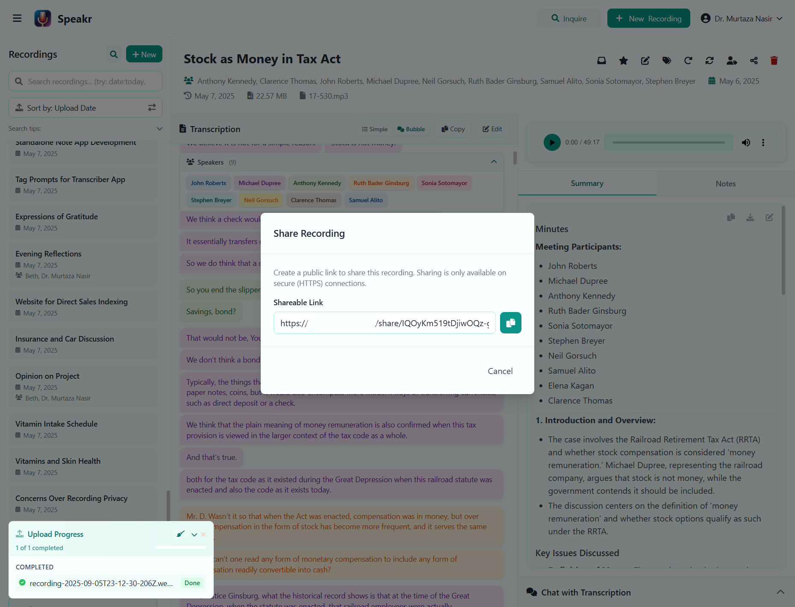
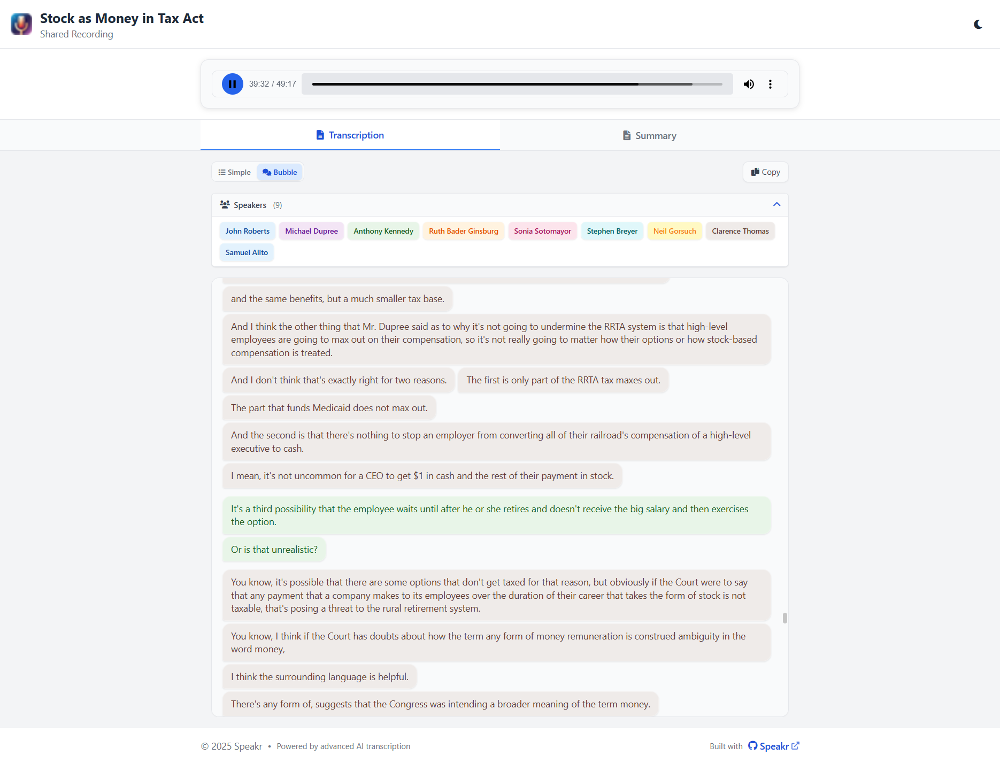
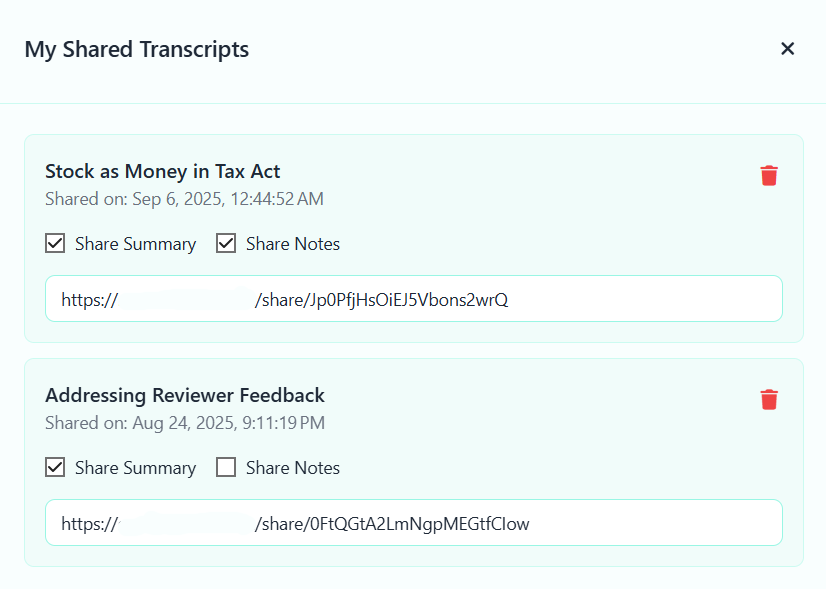

# Sharing Recordings

Sometimes you need to share a recording with someone who doesn't have a Speakr account - perhaps a client needs to review a meeting, a colleague missed an important discussion, or you want to provide documentation to stakeholders. Speakr's sharing feature lets you create secure, read-only links to your recordings while maintaining complete control over what information is shared.

## Understanding Recording Shares

When you share a recording, Speakr generates a unique, secure link that provides access to that specific recording without requiring the recipient to log in or have an account. Each share link is cryptographically secure and impossible to guess, ensuring that only people you explicitly share with can access your content.

The sharing system gives you granular control over what recipients can see. You decide whether to include your AI-generated summary, your personal notes, or both. The transcription itself is always included, as it forms the core content of the recording. Recipients get a clean, professional view of your recording without any of the administrative interface or your other recordings.

## Requirements for Sharing

Before you can share recordings, your Speakr instance must meet two critical requirements. First, it must be accessible via HTTPS with a valid SSL certificate. Second, it must be reachable from the internet with a proper domain name or public IP address.

These requirements exist because share links need to be accessible to recipients who don't have accounts and may be accessing from anywhere. A local network installation or non-HTTPS setup cannot generate shareable links - the share button will either be disabled or display an error message explaining that sharing requires a secure, internet-accessible connection. If you're running Speakr internally without SSL or public access, you'll need to work with your IT team to set up proper HTTPS and internet routing before the sharing feature becomes available.

## Creating a Share Link

Once your instance meets the requirements, sharing a recording takes just a few clicks. While viewing any recording, click the share button in the toolbar to open the sharing modal. This presents you with two simple checkboxes that control what information will be visible to recipients.

The "Share Summary" option determines whether recipients can see the AI-generated summary of your recording. This is particularly useful when sharing with executives or stakeholders who need a quick overview without reading the entire transcription. The summary provides them with key points, decisions, and action items in a digestible format.

The "Share Notes" option controls whether your personal notes are visible. These are the markdown notes you've added to provide context, follow-ups, or additional thoughts about the recording. Consider carefully whether these notes are appropriate for your audience - they might contain internal observations or personal reminders that aren't meant for external viewing.

Once you've selected your options, click "Create Share Link" to generate the secure URL. The link appears immediately in the modal, ready to copy to your clipboard. This link is permanent until you explicitly revoke it, so recipients can bookmark it for future reference.

## What Recipients Experience

When someone clicks your share link, they're taken to a streamlined view of your recording designed for easy consumption without distractions. The interface is clean and professional, branded with Speakr but showing only the content you've chosen to share.

At the top of the page, recipients see the recording title prominently displayed along with a note indicating it's a shared recording. The audio player sits just below, providing full playback controls so they can listen to the original recording at their own pace. The player shows the total duration and current position, allowing recipients to navigate to specific moments or replay important sections.

The main content area is divided between the transcription and summary (if you've chosen to share it). The transcription appears with clear formatting, including speaker labels if your recording includes speaker diarization. Each identified speaker appears as a colored tag, making it easy to follow multi-person conversations. The interface includes view options like Simple and Bubble modes if speaker identification is present, and a copy button to easily extract the text.

If you've enabled summary sharing, it appears in a dedicated panel with its own copy functionality. The summary is rendered with full markdown formatting, presenting a professional overview of the key points from your recording. Your notes, if shared, would appear in a similar panel, providing additional context and insights.

At the bottom of the page, recipients see a subtle footer indicating the content is "Powered by advanced AI transcription" with a link to Speakr. This gives your shares a professional appearance while maintaining the focus on your content. The entire experience is read-only - recipients cannot edit anything, cannot access your other recordings, and cannot see any of your account information or settings.

## Managing Your Shared Recordings

All your shared recordings are centrally managed through the Shared Transcripts section in your account settings. This gives you a complete overview of everything you've shared and with whom.

The shared transcripts list shows each recording you've shared, when you created the share link, and what options you selected (summary and/or notes). Each entry includes the full share URL that you can copy again if needed - perhaps you've lost the original link or need to reshare with additional people.

You can modify what's included in a share by toggling the summary and notes checkboxes directly in this interface. These changes take effect immediately for anyone accessing the link. This is useful when you initially share just the transcription but later decide to include the summary, or when you want to remove notes that are no longer relevant.

The delete button next to each share instantly revokes access. Once deleted, the share link becomes invalid and anyone trying to access it will see an error message. This gives you complete control over the lifecycle of your shared content.

## Security and Privacy Considerations

Speakr requires HTTPS for all sharing operations, ensuring that share links can only be created and accessed over secure connections. This protects the content during transmission and prevents interception of sensitive recordings.

Each share link contains a cryptographically secure random token that's unique to that specific share. These tokens are generated using security best practices and are long enough to make guessing or brute-force attacks infeasible. Even if someone knows you've shared other recordings, they cannot derive or guess the links to those shares.

It's important to understand that share links don't require authentication - anyone with the link can access the recording. This makes sharing convenient but means you should treat these links with the same care you'd treat sensitive documents. Share them only through secure channels like encrypted email or private messages, never post them publicly, and revoke access when it's no longer needed.

The system doesn't track who accesses shared links or how often they're viewed. This respects recipient privacy but means you won't know if a link has been forwarded to others. If you need tighter access control, consider asking recipients to create Speakr accounts instead of using public sharing.

## Best Practices for Sharing

When sharing internally within your organization, you can generally include both summaries and notes since colleagues have context about the discussions and need complete information. The notes often contain valuable action items, follow-ups, and clarifications that help team members understand not just what was said, but what needs to happen next.

For external sharing with clients or partners, consider sharing only the summary without your internal notes. The summary provides them with professional, polished takeaways while your notes remain private for internal use. Review the content before sharing to ensure nothing confidential or inappropriate is included.

When sharing for documentation or compliance purposes, focus on the transcription itself as the authoritative record. The word-for-word transcription with timestamps provides an accurate account of what was discussed, while summaries and notes represent interpretations that might not be appropriate for official records.

Always review what you're sharing before sending the link. Once someone has accessed the content, they could save or screenshot it, so revoking the link later won't remove their access to information they've already viewed. If you realize you've shared something inappropriate, revoke the link immediately to prevent further access, but assume that previous viewers may have retained the information.

## Common Sharing Scenarios

Meeting participants often appreciate receiving a share link after important discussions. Include both the summary and notes to give them a complete picture of decisions made and actions required. This is especially valuable for participants who may have missed parts of the meeting or need to review specific details.

When updating clients on project progress, share recordings of internal discussions with summaries but without internal notes. This gives them transparency into your process and decisions while maintaining appropriate boundaries about internal deliberations.

For training and onboarding, shared recordings become valuable learning resources. New team members can listen to past discussions to understand project history, decision rationale, and team dynamics. Include comprehensive notes to provide context that might not be obvious from the transcription alone.

Legal and compliance teams may require unedited transcriptions of important conversations. In these cases, share only the transcription without summaries or notes that could be seen as interpretation or editorial commentary. The raw transcription provides an objective record of what was said.

## Limitations and Considerations

Share links are designed for occasional sharing with individuals or small groups, not for mass distribution or public posting. The system isn't optimized for hundreds of concurrent viewers, and publicly posted links could expose sensitive information to unintended audiences.

Currently, shares don't expire automatically, though this feature may be added in future updates. Once created, a share link remains valid until you manually revoke it. This means you should periodically review your shared recordings and remove access to those no longer needed.

The sharing feature is only available over HTTPS connections for security reasons. If you're running Speakr on a local network without SSL certificates, you won't be able to create share links. This is a deliberate security measure to prevent sensitive recordings from being shared over unencrypted connections.

Recipients need a modern web browser to view shared recordings. The audio player and transcription display require JavaScript and HTML5 support. While this covers the vast majority of users, recipients using very old browsers or restrictive corporate environments might experience issues.