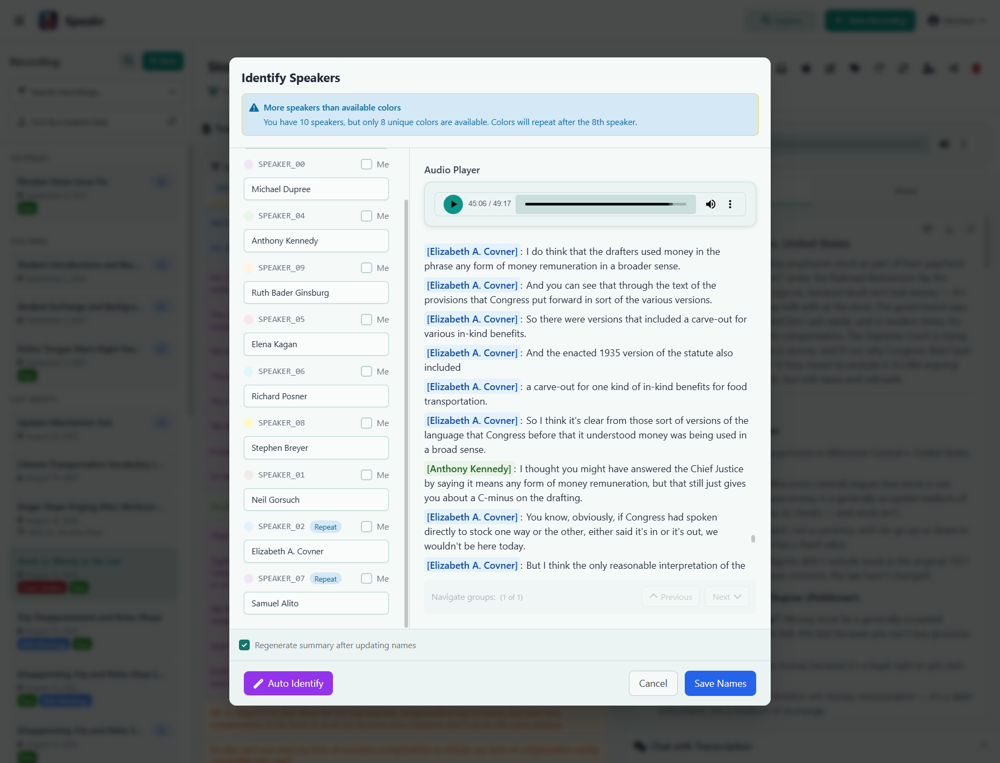
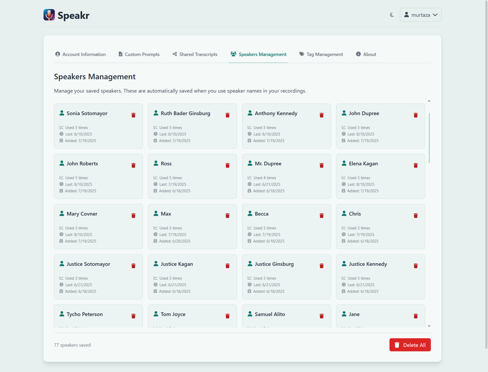
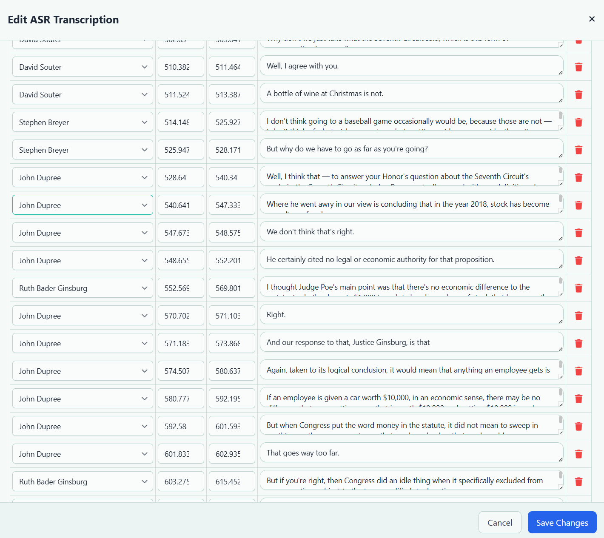
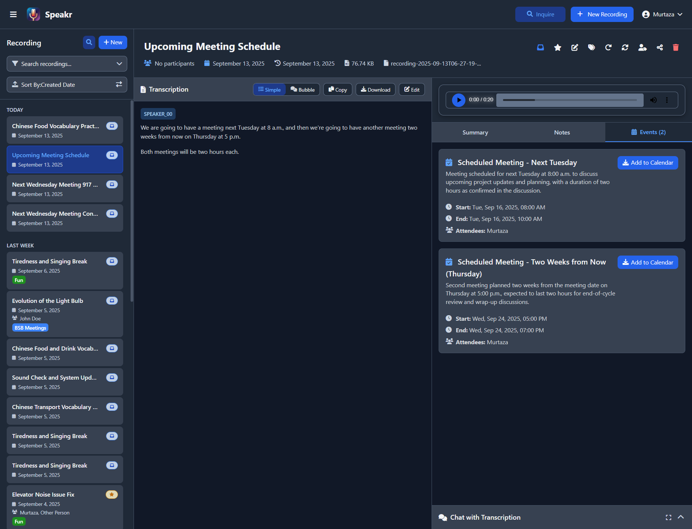
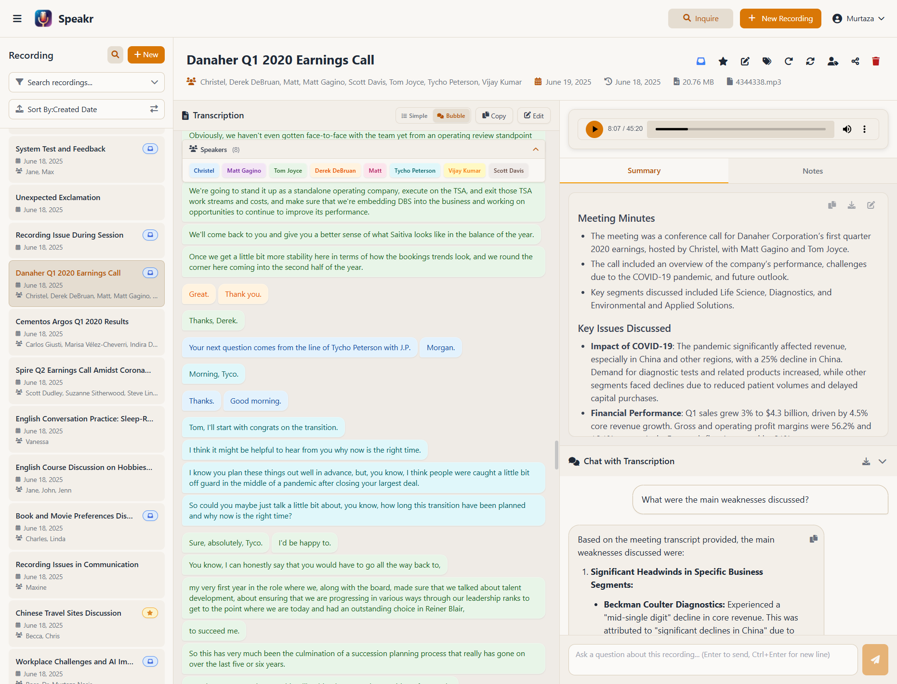
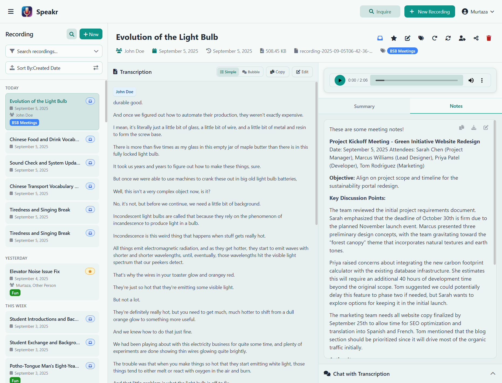

# Working with Transcriptions

Once your audio has been processed, Speakr provides a rich set of tools for viewing, editing, and interacting with your transcriptions. This section covers everything you need to know about working with transcribed content. For information on the transcription process itself, see [transcription features](../features.md#core-transcription-features).

## Understanding the Transcription View

When you select a recording from the sidebar, the center panel displays the full transcription. The layout is designed for easy reading and navigation, with clear visual indicators for different speakers and timestamps.

## Speaker Identification

If your recording was processed with [speaker diarization](../features.md#speaker-diarization) enabled, each speaker's contributions are labeled with colored tags like SPEAKER_01, SPEAKER_02, and so on. This requires the [ASR endpoint](../getting-started.md#option-b-custom-asr-endpoint-configuration). These labels are automatically generated during transcription and help you follow multi-person conversations.

### Identifying Speakers

When you need to assign real names to speaker labels, click the speaker identification button in the toolbar. This opens a modal where you can:

The speaker identification modal shows each detected speaker with a sample of their dialogue to help you identify them. You can enter real names for each speaker, and these names will replace the generic labels throughout the transcription. The system remembers these assignments for future reference, making it easier to identify the same speakers in subsequent recordings.

### Managing Saved Speakers

All speakers you identify are automatically saved to your speaker database. You can manage these saved speakers through the dedicated [Speakers Management tab](settings.md#speakers-management-tab) in your [account settings](settings.md). Navigate to Account > Speakers Management to view all your saved speakers.

The Speakers Management interface displays all your saved speakers in a responsive grid layout. Each speaker card shows the speaker's name, usage statistics including how many times they've been identified, when they were last used in a recording, and when they were first added to your database. The interface includes internal scrolling to handle large numbers of speakers while keeping the header and action buttons always visible.

You can delete individual speakers by clicking the trash icon on their card, or use the "Delete All" button to clear your entire speaker database. This is useful for maintaining privacy or when you need to start fresh with a new set of speakers. The speaker count at the bottom keeps track of how many speakers you have saved.

The system uses these saved speakers to provide suggestions when you're identifying speakers in new recordings, making the identification process faster over time as you build up your speaker database.

## Editing Transcriptions

Speakr provides two different editing modes depending on the type of transcription you're working with.

### Simple Text Editing

For standard transcriptions without speaker diarization, click the Edit button in the toolbar to enter a simple text editor. Your edits are preserved even when you [regenerate summaries](../features.md#automatic-summarization) or use the chat feature. This allows you to make corrections to the entire transcription as a single text block. You can fix transcription errors, add punctuation, insert clarifications, and improve formatting. Your changes are saved when you click the Save button.

### Advanced ASR Segment Editing

For transcriptions processed with [ASR](../features.md#speaker-diarization) and speaker diarization, Speakr offers a powerful segment-based editor that preserves the structure and timing of your transcription. If you encounter issues with speaker identification, see [troubleshooting](../troubleshooting.md#speaker-identification-not-working).

The ASR editor presents your transcription as a table of segments, where each row represents a single utterance with its associated metadata. For each segment, you can:

**Edit Speaker Names**: Each segment shows who is speaking. You can click on any speaker field to change it, with an intelligent dropdown that suggests speakers from your saved speaker database. As you type, the system filters suggestions to help you quickly find the right speaker. This is particularly useful for correcting misidentified speakers or standardizing speaker names across the transcription.

**Adjust Timestamps**: The start and end times for each segment can be fine-tuned using the adjustment arrows. This is helpful when the automatic segmentation isn't quite right, allowing you to precisely mark when each person starts and stops speaking.

**Edit Text Content**: The main content of each utterance can be edited directly in its text field. You can correct transcription errors, fix grammar, add punctuation, or clarify unclear speech while maintaining the segment structure.

**Manage Segments**: Use the trash icon to remove segments that shouldn't be in the transcription (such as false detections or noise). You can also add new segments if the ASR system missed something, positioning them with appropriate timestamps.

The ASR editor maintains the JSON structure of your transcription, which is essential for features like speaker-based search, audio synchronization (clicking on text to jump to that point in the audio), and proper display in bubble view. When you save changes in the ASR editor, the system preserves all timing and speaker information while applying your corrections.

Your edits are saved to the database when you click "Save Changes". The system maintains a record that the transcription has been manually edited, which is useful for quality control and audit purposes. Note that if you reprocess the transcription later with full transcription reprocessing, your manual edits will be overwritten. To preserve your edits while updating the summary, use summary-only reprocessing instead.

## View Options

The transcription panel offers two display modes to suit different preferences:

### Simple View

The default simple view presents the transcription as flowing text with inline speaker labels. This format is ideal for reading through content quickly and copying text for use in other applications. The clean, document-like appearance makes it easy to focus on the content without visual distractions.

### Bubble View

The bubble view formats the transcription like a chat conversation, with each speaker's contributions in separate message bubbles. This format works particularly well for interviews, debates, or any recording with back-and-forth dialogue. The visual separation makes it easier to follow who said what in rapid exchanges.

## Using the Summary Feature

The Summary tab in the right panel contains an AI-generated overview of your recording. This summary is automatically created after transcription and captures key points, decisions, and action items.

The summary is designed to save you time by highlighting the most important information from your recording. It typically includes main topics discussed, key decisions or conclusions reached, action items and assignments, important dates or deadlines mentioned, and any significant problems or concerns raised.

### Customizing Summary Prompts

Speakr provides multiple levels of customization for summary generation, allowing you to tailor the AI's output to your specific needs. The summary prompt can be customized at three different levels:

**Admin Level**: System administrators can set a default summary prompt that applies to all users who haven't configured their own. This is configured in the Admin Dashboard under Default Prompts and serves as the baseline for the entire system.

**User Level**: Individual users can set their personal summary prompt in [Account Settings under Custom Prompts](settings.md#custom-prompts-tab). This overrides the admin default and applies to all of their recordings unless a tag-specific prompt is used.

**Tag Level**: Each tag can have its own custom prompt configured. When creating or editing a tag, you can specify a summary prompt that will be used for any recording with that tag. This is particularly powerful for different types of content - for example, a "Legal Meeting" tag might focus on compliance issues and risk factors, while a "Product Planning" tag might emphasize features and timelines.

### Prompt Precedence and Stacking

When generating a summary, Speakr follows a clear precedence order to determine which prompt to use:

1. **Tag Custom Prompts** (highest priority): If a recording has tags with custom prompts, these take precedence. When multiple tags with custom prompts are applied to a recording, Speakr intelligently combines them in the order the tags were added. This creates a sophisticated stacking effect where you can have a base tag like "Meeting" with general instructions, then add modifier tags like "Client-Facing" or "Technical Discussion" that add specific requirements. The prompts are seamlessly merged to create comprehensive instructions for the AI.

2. **User Summary Prompt**: If no tag prompts are present, the system uses your personal summary prompt configured in your account settings.

3. **Admin Default Prompt**: When neither tag nor user prompts are configured, the system falls back to the administrator-configured default prompt.

4. **System Fallback**: If no custom prompts exist at any level, Speakr uses a built-in default that generates sections for key issues, decisions, and action items.

### Summary Quality Factors

The quality of your generated summaries depends on two key factors:

**Prompt Design**: Well-crafted prompts that clearly specify what information you want extracted will produce more useful summaries. Consider including specific sections you want, the level of detail needed, and any particular focus areas relevant to your use case.

**LLM Selection**: The AI model you use significantly impacts summary quality. More advanced models like GPT-4 or Claude will generally produce more nuanced and accurate summaries compared to smaller models. The model can be configured by your administrator in the system settings, balancing between quality and cost.

### Editing and Exporting Summaries

The summary is fully editable using a markdown editor similar to the one in the Notes section. Click the edit button (pencil icon) in the summary toolbar to enter edit mode. The markdown editor provides a rich editing experience with formatting tools for bold, italic, headings, lists, links, and more. You can restructure the summary, add additional insights, or refine the AI-generated content to better suit your needs. Changes are auto-saved as you type, ensuring you don't lose your edits.

You can export the summary in multiple ways. The copy button copies the entire summary to your clipboard in markdown format, ready to paste into emails, documents, or other applications. The download button exports the summary as a Microsoft Word (.docx) file, preserving formatting and making it easy to share with colleagues who prefer traditional documents. The downloaded file is named using the recording title and date for easy identification.

You can regenerate the summary with different settings if needed, which is useful if you want to focus on different aspects of the content or if you've made significant edits to the transcription. When regenerating, you can temporarily adjust tags to apply different prompts without permanently changing the recording's categorization.

## Event Extraction

When event extraction is enabled in your account settings, Speakr automatically identifies calendar-worthy events from your recordings during the summary generation process. This feature intelligently detects meetings, deadlines, appointments, and other time-sensitive items mentioned in your conversations.

### Viewing Extracted Events

After a recording is processed with event extraction enabled, an Events tab appears in the right panel if any events were detected. The tab shows a clean list of identified events, each displaying the event title, date, time, and description extracted from the conversation. Events are automatically parsed with intelligent date recognition that understands relative references like "next Tuesday" or "in two weeks" based on the recording date.

### Exporting to Calendar

Each extracted event can be exported as an ICS file that's compatible with virtually any calendar application including Google Calendar, Outlook, Apple Calendar, and Thunderbird. Simply click the download button next to any event to save it as a calendar file. The ICS file includes the event title, date and time, and a description with context from the recording. When no specific time is mentioned in the conversation, events default to 9 AM to ensure they appear prominently in your calendar.

### Enabling Event Extraction

Event extraction can be toggled on or off in your Account Settings under the Custom Prompts tab. When enabled, the system adds event extraction instructions to your summary prompt, asking the AI to identify calendar-worthy items during summary generation. This feature works with any LLM provider configured in your system and adapts to different conversation styles, from formal meetings to casual discussions. The quality of event extraction depends on the AI model being used, with more advanced models providing better detection of nuanced scheduling references.

## Interactive Chat

The Chat tab provides an AI assistant that can answer questions about your recording. This feature is particularly powerful for long recordings where finding specific information might be time-consuming.

### Effective Chat Queries

The AI chat understands context and can answer various types of questions about your recording. You can ask for specific information like "What did Sarah say about the budget?" or "When is the deadline for the project?" The AI can also provide analysis, such as "What were the main concerns raised?" or "Summarize the action items for the marketing team."

The chat maintains context throughout your conversation, so you can ask follow-up questions. For example, after asking about budget discussions, you might follow up with "What solutions were proposed?" The AI will understand you're still talking about the budget topic.

### Chat Best Practices

For best results with the chat feature, be specific in your questions rather than asking overly broad queries. Reference specific topics, people, or timeframes when possible. If the AI's response isn't quite what you're looking for, try rephrasing your question with more context.

The chat feature works best for factual questions about what was said in the recording. It's less effective for subjective interpretations or reading between the lines, though it can identify tone and sentiment to some degree.

### Exporting Chat Conversations

Your entire chat conversation can be exported for future reference or sharing. The chat interface provides two export options:

**Copy to Clipboard**: Click the copy button to copy the entire chat conversation to your clipboard. This preserves the question-and-answer format, making it easy to paste into emails, reports, or documentation. Each message includes a label indicating whether it's from you or the AI assistant.

**Download as Word Document**: The download button exports your complete chat history as a formatted Microsoft Word (.docx) file. This includes all questions and responses in a clean, professional format that's easy to share with team members or include in reports. The file is automatically named with the recording title and export date, making it easy to organize multiple chat exports.

These export features are particularly useful when you've used the chat to extract specific insights or conduct a detailed analysis of the recording, allowing you to preserve and share your findings without having to recreate the conversation.

## Adding and Managing Notes

The Notes tab is your personal workspace for adding context and thoughts about the recording. These notes are private to you and complement the transcription with your own insights.

Notes support full markdown formatting, allowing you to create structured documents with headers, lists, links, and emphasis. The markdown editor provides a toolbar with formatting options and supports keyboard shortcuts for efficient note-taking. You can switch between edit and preview modes to see how your formatted notes will appear.

Common uses for notes include:

- Personal reflections on the meeting or conversation that wouldn't be appropriate in the shared transcription
- Follow-up tasks that you need to complete based on the discussion
- Additional context about decisions made or why certain topics were discussed
- Links to related documents or resources mentioned in the recording
- Questions you want to research or clarify later

Your notes are fully searchable alongside transcriptions, making them valuable for future reference. You can search for a specific term and find it whether it appears in a transcription or in your personal notes. Notes are auto-saved as you type, ensuring you never lose your thoughts.

## Copying and Exporting

The Copy button in the transcription toolbar copies the entire transcription to your clipboard in plain text format. This maintains paragraph structure, making it easy to paste into documents or emails.

### Downloading Transcriptions

Next to the Copy button, you'll find the Download button that offers flexible export options through customizable templates. When you click Download, a popup appears allowing you to select from your saved [transcript templates](transcript-templates.md) or export the raw transcript without formatting. Templates let you control exactly how your transcript is formatted, whether you need timestamps for subtitles, speaker-focused formats for interviews, or screenplay-style formatting. You can create and manage these templates in your account settings.

If your recording was processed with ASR and speaker diarization, the exported text will include speaker identifiers (either the generic labels like SPEAKER_01 or the actual names if you've identified them). For recordings without speaker diarization, the transcription is exported as continuous text. The format remains consistent regardless of whether you're viewing the transcription in simple or bubble view - the exported text uses the structured format from the underlying data, formatted according to your chosen template.

## Next Steps

Now that you understand how to work with transcriptions, let's explore Speakr's powerful search capabilities with Inquire Mode, which allows you to search across all your recordings using natural language.

---

Next: [Inquire Mode - Semantic Search](inquire-mode.md) →